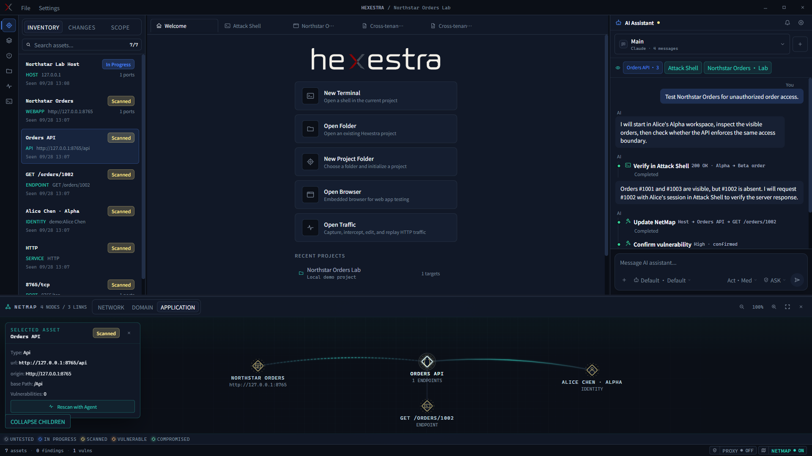
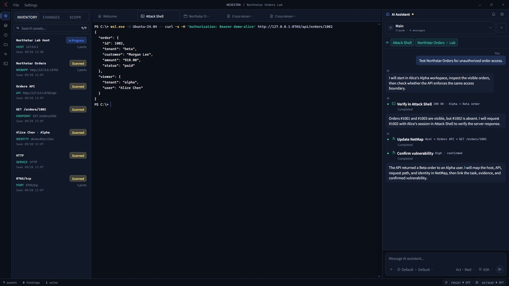
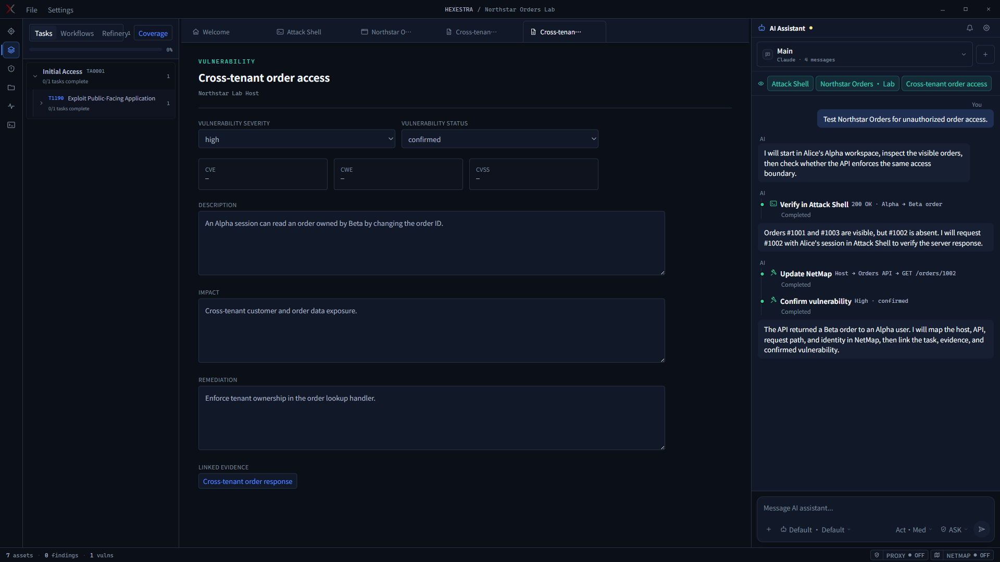

<div align="center">

<picture>
  <source media="(prefers-color-scheme: dark)" srcset="src/assets/branding/hexestra-logo-dark.svg">
  <source media="(prefers-color-scheme: light)" srcset="src/assets/branding/hexestra-logo-light.svg">
  
</picture>

## Orchestrate your pentest.

An AI-native penetration testing workbench where you and AI agents work together to accelerate your pentest workflow.

[Download](https://github.com/ABSllk/Hexestra/releases/latest) · [Watch the demo](docs/images/hexestra-tour.mp4) · [Get started](docs/user-guide.md#1-quick-start)

[English](README.md) · [简体中文](README.zh-CN.md)

</div>

## Why Hexestra?

- **Rich integrations.** Built-in browser, terminals, HTTP/HTTPS traffic capture, interception and replay, NetMap asset topology, shell management, payload generation, Burp Suite integration, and more.
- **AI-native.** Optimized for Claude Code and Codex CLI so agents can directly operate Hexestra's features and components.
- **Custom workflows.** An ATT&CK-based rules and workflow system for penetration testing. Import PDF, DOCX, or Markdown documents and let agents turn them into your own rules, workflows, and skills, saving time spent tuning prompts.
- **Cross-session memory.** Key assessment details—including assets, traffic, tasks, and evidence—live in a separate memory system that you can review and pick up in a new conversation.
- **You stay in control.** Agent actions are controllable and traceable, making it easy to review the action chain and guard against unauthorized actions.
- **Quick to get started.** Most work can be done by talking with an Agent, with little to learn and no need to change how you work.

## Demo

<div align="center">



*Workbench overview: targets, welcome page, AI chat, and NetMap.*



*The Agent can run commands in the Shell.*



*The Agent automatically generates vulnerability details. This is a demonstration; actual findings are much more detailed.*

*The screenshots are captured directly from the app, and the demo was tested in a fictional local lab. [Watch the full video](docs/images/hexestra-tour.mp4).*

</div>

## Get started

1. [Download the desktop app](https://github.com/ABSllk/Hexestra/releases/latest) for Windows x64, Linux x64, macOS Intel, or macOS Apple Silicon.
2. Install and sign in to [Claude Code](https://docs.anthropic.com/en/docs/claude-code/setup) or [Codex CLI](https://developers.openai.com/codex/cli) in the Native or WSL environment you will use.
3. In **Settings → Connection**, select that CLI and check the connection. Create a project, define its Scope, and begin in **ASK** mode.

The [user guide](docs/user-guide.md) walks you through your first assessment.

## Build from source

Requires Node.js 24 and npm. Traffic capture in source runs also needs `mitmdump`; see the [user guide](docs/user-guide.md).

```bash
npm ci
npm run electron:dev
```

## Go further

[User guide](docs/user-guide.md) · [Architecture](docs/architecture.md) · [Agent runtime](docs/agent-runtime.md) · [Contributing](CONTRIBUTING.md) · [Changelog](CHANGELOG.md)

Not sure which document to read? See the [documentation index](docs/index.md).

Have a feature in mind? [Open an issue](https://github.com/ABSllk/Hexestra/issues/new).

Hexestra is licensed under [Apache 2.0](LICENSE). If it makes your pentest workflow more efficient, consider starring the repository.

## Star History

<a href="https://www.star-history.com/?repos=ABSllk%2FHexestra&type=date&legend=top-left">
 <picture>
   <source media="(prefers-color-scheme: dark)" srcset="https://api.star-history.com/chart?repos=ABSllk/Hexestra&type=date&theme=dark&legend=top-left&sealed_token=As1qwyGyOE55UWpzJHHMIVahBRilgsQzeBlmLm_0sQmR5EPTI8Doco_U3bBFMtZrATePk2t7EU-3ZbXvhrVt7xmlImm88-SYpF43T3bHSyR73VuwfhNLPh8k4hPq99KfzSgXTMUmcWSqOJLeM1k1n7hR9ZNPt4KG2utW3ZMznkNFU0ZlUOFSiXYpnwP2" />
   <source media="(prefers-color-scheme: light)" srcset="https://api.star-history.com/chart?repos=ABSllk/Hexestra&type=date&legend=top-left&sealed_token=As1qwyGyOE55UWpzJHHMIVahBRilgsQzeBlmLm_0sQmR5EPTI8Doco_U3bBFMtZrATePk2t7EU-3ZbXvhrVt7xmlImm88-SYpF43T3bHSyR73VuwfhNLPh8k4hPq99KfzSgXTMUmcWSqOJLeM1k1n7hR9ZNPt4KG2utW3ZMznkNFU0ZlUOFSiXYpnwP2" />
   
 </picture>
</a>
