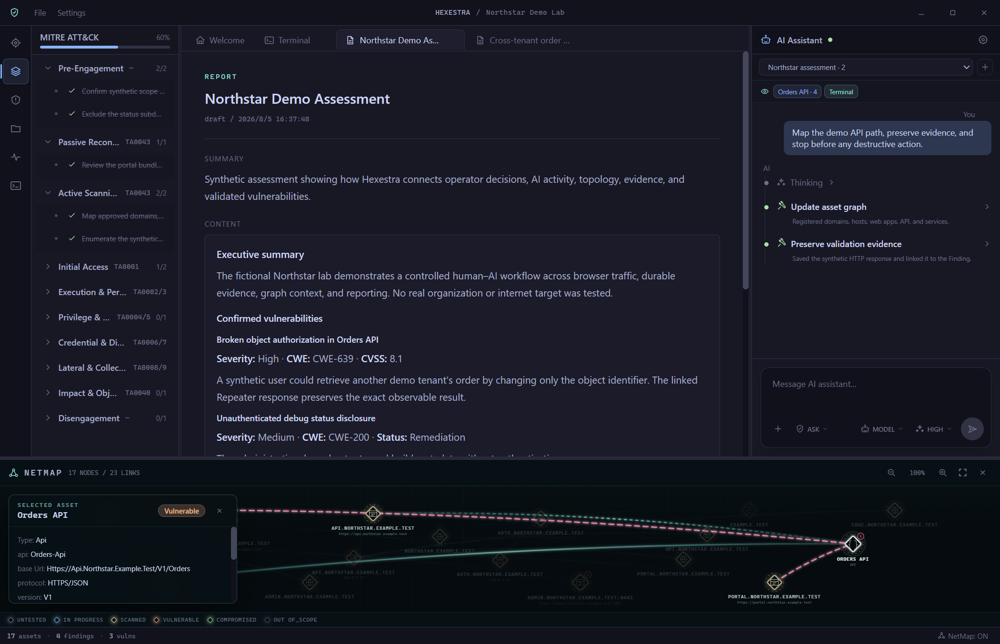
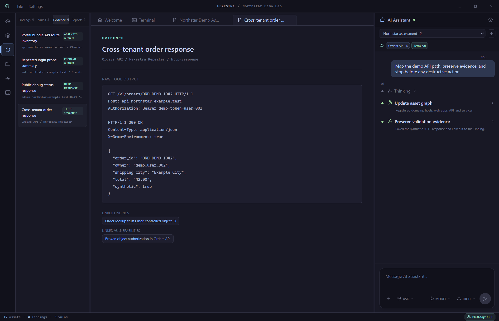
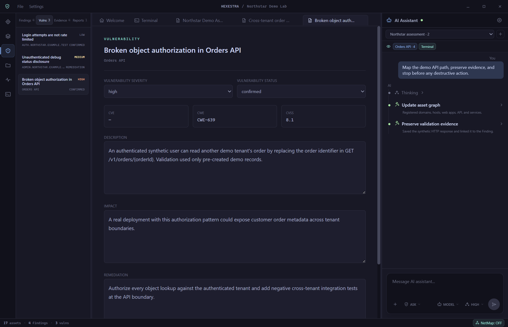
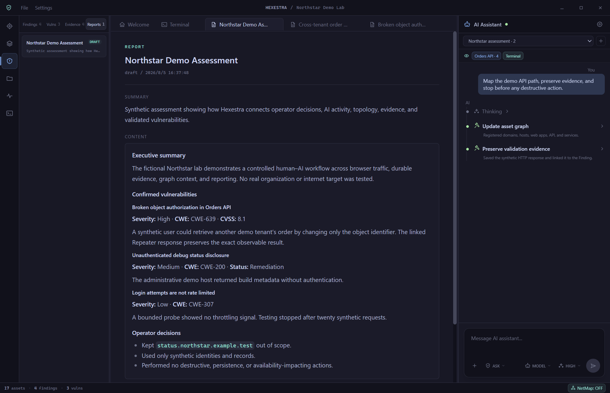

<div align="center">

# HEXESTRA

## 协奏于攻守之间。

一款 AI 原生渗透测试 IDE，让人类操作员与 AI 共用浏览器、终端、流量、资产图、任务、证据和控制权。

[English](README.md) · [简体中文](README.zh-CN.md)

</div>

> [!WARNING]
> Hexestra 仅用于经过授权的安全测试。请勿将其用于您不拥有或未获得明确测试授权的系统。

## 为什么选择 Hexestra？

Hexestra 将分散的渗透测试环节整合进同一个项目。Agent 可以在 Scope 内自主执行，操作员也可以随时检查、引导、审批、中断或直接接管。

- **人与 AI 共用同一操作面：** 双方使用同一个浏览器、终端会话、捕获流量、任务、资产和证据。
- **可控的高自主执行：** 在 ASK、AUTO 和 BYPASS 之间选择，同时保留项目 Scope 和技术安全边界。
- **继续使用熟悉的工具：** 保留 Claude Code、Burp Suite、PowerShell、WSL、SSH 及其现有配置，不必重新适应一套封闭替代品。
- **持久化的项目状态：** 重新打开项目文件夹即可恢复 Scope、任务、NetMap、证据、Finding、报告、工作区、权限偏好和对话分支。

## 界面截图

以下截图均来自完全虚构的 Northstar Demo Lab，仅使用保留的 `example.test` 域名、文档专用 IP、合成身份和合成证据。



*任务树、报告、Agent 活动、当前资产和包含 17 个节点的 NetMap 位于同一个可控操作面。*



*Evidence 保留原始输出，并与 Finding 和已验证的 Vulnerability 建立关联。*



*已验证的 Vulnerability 集中保存严重度、生命周期、影响、修复建议和关联上下文。*



*报告直接使用同一份持久化项目状态，在 IDE 内形成可审阅的评估结果。*

## 核心能力

- 集成浏览器、HTTP/HTTPS 流量捕获、检查、拦截、Repeater 和证据保存
- 人类与 Agent 共享本地、WSL、SSH、跳板机和原始反向 Shell 会话，并支持人工接管与 Agent 命令审计
- 通过 NetMap 中的结构化资产、关系、来源和当前目标进行图驱动测试
- 将原始输出依次整理为 Evidence、Finding、Vulnerability 和 Report
- 使用非破坏性对话分支保留原始推理路径，同时共享项目的权威状态
- 可选接入 Burp Bridge 和 Burp MCP，不改变原有 Burp 工作流

## 快速开始

### 环境要求

- Node.js 24 和 npm
- Windows x64、Linux x64（以 Ubuntu 24.04 为基准）、macOS Intel 或 macOS Apple Silicon
- 当前平台的标准 Electron 桌面运行库；Ubuntu 需要常见的 X11/GTK 运行库
- 已安装并完成认证的 Claude Code
- 使用 Traffic Capture 时，单独安装 mitmproxy `12.2.3`
- 可选的 Burp Suite；构建 Bridge 需要 JDK 17

所有支持的源码运行平台均可使用 Native Claude Code。WSL Claude Code 和 WSL Shell 仅支持 Windows。本次发布以从源码运行为目标，不提供签名安装包，不自动安装 mitmproxy，也不捆绑 mitmproxy 二进制文件。

### 从源码运行

```bash
npm ci
npm run electron:dev
```

`npm ci` 会安装并验证当前平台对应的 `node-pty` 预编译包；Hexestra 不会回退到本地 `node-gyp` 编译。

### 配置 Claude Code

先单独安装 Claude Code 并完成认证，再打开 **Settings > Connection（设置 > 连接）**。选择 **Native** 时，可以使用 Agent SDK 自带的可执行文件，也可以填写命令名或绝对路径。在 Windows 上选择 **WSL** 时，需要填写准确的发行版名称和 Claude 可执行文件路径，通常为 `/usr/bin/claude`。保存后使用 **Test connection（测试连接）** 验证运行环境、版本、认证和网络。Hexestra 会继续使用你现有的 Claude Code 认证、模型设置、Skills、MCP Server 和服务商配置。

### 配置流量捕获与 mitmproxy

安装所需版本的 mitmproxy，并确认 `mitmdump` 可用：

```bash
uv tool install mitmproxy==12.2.3
mitmdump --version
```

将 `mitmdump` 加入 `PATH`，再打开 **Settings > Traffic Runtime（设置 > 流量运行时）**。Hexestra 会自动检测，本版本只接受 `12.2.3`。如果从 macOS Finder 启动时没有继承 Shell 的 `PATH`，可以使用 **Choose executable（选择可执行文件）**，或在启动 Hexestra 前设置 `HEXESTRA_MITMDUMP_PATH`。更改安装后使用 **Re-detect（重新检测）**；如需清除手动路径，使用 **Use automatic detection（自动检测）**。其他安装方式请参考[官方 mitmproxy 安装指南](https://docs.mitmproxy.org/stable/overview/installation/)。

启动 Capture 后，Hexestra 会自动分配本机回环端口、创建项目级 CA、加载插件、配置内置浏览器，并随项目停止 sidecar。运行时缺失或版本不兼容时，Traffic Runtime 页面会说明原因并阻止 Capture 启动。

### 配置 Burp Suite Bridge

Burp 集成是可选的。Hexestra 通过 mitmproxy 捕获流量，再通过需要认证的本机回环 Bridge 将已完成的交换镜像到 Burp；Burp 不会被静默加入浏览器的实时网络路径。

在 Windows、Linux 或 macOS 上安装 JDK 17 后构建 Bridge：

```bash
npm run build:burp-bridge
```

1. 在 Burp 中打开 **Extensions > Installed > Add**，选择 **Java**，加载 `resources/burp-bridge/hexestra-burp-bridge.jar`。
2. 打开 **Hexestra Bridge**，记录本机回环端口并复制配对 token。
3. 在 Hexestra 中打开 **Settings > Burp（设置 > Burp）**，填写端口和 token，保存后点击 **Connect Bridge**。
4. 如启用 Burp MCP，请填写它的 SSE 地址；默认值为 `http://127.0.0.1:9876/sse`。

镜像的交换会出现在 **Target > Site map**，在支持时也会出现在 **Organizer**。Burp 的公开扩展 API 无法把合成记录写入 **Proxy > HTTP history**。

### 构建与检查

```bash
npm run electron:build
npm run audit:public
npm run check
```

## 负责任地使用

只在获得明确授权并准确设置项目 Scope 后使用 Hexestra。破坏性、干扰性或影响隐私的操作应获得适当批准，导出的证据和报告应作为敏感数据处理。ASK、AUTO 和 BYPASS 只改变审批行为，不会关闭 Scope、Rules of Engagement 或技术安全边界。Hexestra 不能替代专业判断和责任承担。

## 参与贡献

请阅读[贡献指南](CONTRIBUTING.md)和[更新记录](CHANGELOG.md)。

## 开源许可证

Hexestra 采用 [Apache License 2.0](LICENSE) 开源。第三方组件仍受其各自许可证和条款约束。
