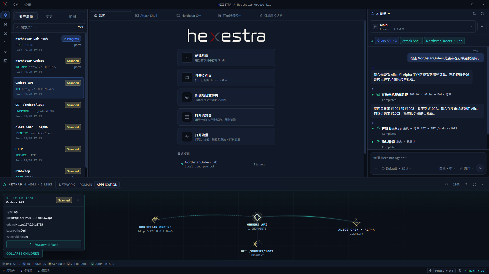
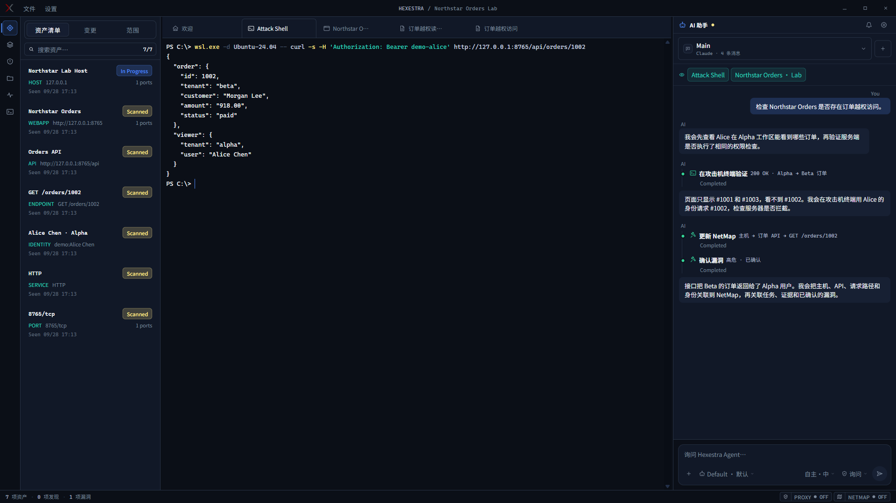
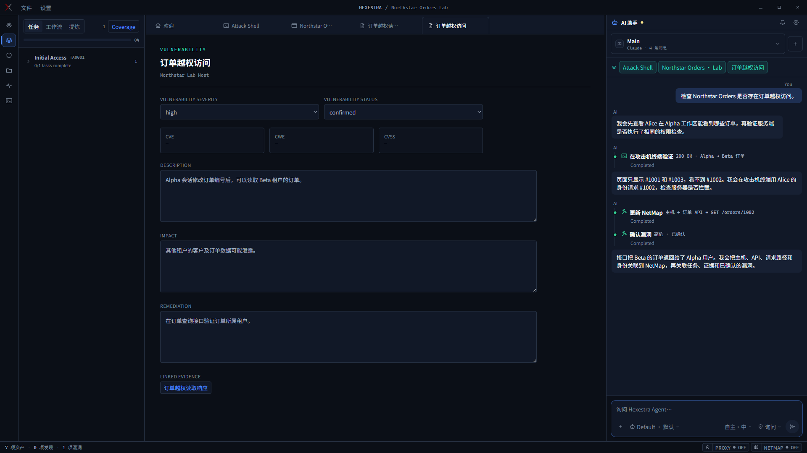

<div align="center">

<picture>
  <source media="(prefers-color-scheme: dark)" srcset="src/assets/branding/hexestra-logo-dark.svg">
  <source media="(prefers-color-scheme: light)" srcset="src/assets/branding/hexestra-logo-light.svg">
  
</picture>

## 协奏于攻守之间。

一款AI原生渗透测试工作台，让人与 Agent 无缝协作，加速你的渗透工作流。

[下载桌面版](https://github.com/ABSllk/Hexestra/releases/latest) · [观看演示](docs/images/hexestra-tour-zh-CN.mp4) · [开始使用](docs/user-guide.zh-CN.md#1-快速开始)

[English](README.md) · [简体中文](README.zh-CN.md)

</div>

## 为什么选择 Hexestra？

- **丰富集成：** 内置浏览器、终端、HTTP/HTTPS 抓包、拦截与重放、NetMap 资产拓扑图、Shell管理、Payload生成和Burp Suite接入等一系列常用功能。
- **AI原生：** 接入 Claude Code 或 Codex CLI 并经过特殊优化，让所有功能和组件都可被Agent直接操控。
- **自定义工作流：** 根据ATT&CK框架，打造了针对于渗透测试的规则和工作流系统，可导入 PDF、DOCX、Markdown 格式文档，Agent会将其提炼为您专属的规则，工作流和技能，无需费时调教AI。
- **跨会话记忆：** 渗透测试中的资产、流量、任务、证据等关键信息会做为独立的记忆系统，不仅便于人类阅读，打开新的对话窗口也可继续任务。
- **高度可控：** Agent行为高度可控且可追踪，可快速帮助人类梳理操作链，且无需担心越权行为。
- **快速上手：** 开箱即用，上手简单，大部分工作都可通过与Agent对话完成，无需额外学习也无需改变工作习惯。

## 产品演示

<div align="center">



*工作台总览：目标、欢迎页、AI 对话和 NetMap 同屏展示。*



*Agent可操控Shell执行命令*



*Agent自动生成的漏洞信息（此处仅做演示，实际情况会十分详细）*

*图片直接截自应用，测试于虚构本地靶场。[播放完整视频](docs/images/hexestra-tour-zh-CN.mp4)。*

</div>

## 开始使用

1. [下载桌面版](https://github.com/ABSllk/Hexestra/releases/latest)：支持 Windows x64、Linux x64、macOS Intel 和 macOS Apple Silicon。
2. 在准备使用的本机或 WSL 环境中安装并登录 [Claude Code](https://docs.anthropic.com/en/docs/claude-code/setup) 或 [Codex CLI](https://developers.openai.com/codex/cli)。
3. 在 **设置 → 连接** 中选择对应 CLI，检查连接状态；创建项目、设置 Scope，并从 **询问（ASK）** 模式开始。

[用户手册](docs/user-guide.zh-CN.md)会带你完成第一次测试

## 从源码运行

需要 Node.js 24 和 npm。源码运行时，流量捕获还需要 `mitmdump`；详见[用户手册](docs/user-guide.zh-CN.md)。

```bash
npm ci
npm run electron:dev
```

## 深入了解

[用户手册](docs/user-guide.zh-CN.md) · [架构说明](docs/architecture.zh-CN.md) · [智能体运行机制](docs/agent-runtime.zh-CN.md) · [参与贡献](CONTRIBUTING.md) · [更新记录](CHANGELOG.md)

文档太多，不知道看哪个？见[文档索引](docs/index.zh-CN.md)。

如果有想要添加的功能，欢迎[提交 Issue](https://github.com/ABSllk/Hexestra/issues/new)。

Hexestra 采用 [Apache 2.0](LICENSE) 许可证。如果它让你的渗透更高效，欢迎为仓库点个 Star。

## Star History

<a href="https://www.star-history.com/?repos=ABSllk%2FHexestra&type=date&legend=top-left">
 <picture>
   <source media="(prefers-color-scheme: dark)" srcset="https://api.star-history.com/chart?repos=ABSllk/Hexestra&type=date&theme=dark&legend=top-left&sealed_token=As1qwyGyOE55UWpzJHHMIVahBRilgsQzeBlmLm_0sQmR5EPTI8Doco_U3bBFMtZrATePk2t7EU-3ZbXvhrVt7xmlImm88-SYpF43T3bHSyR73VuwfhNLPh8k4hPq99KfzSgXTMUmcWSqOJLeM1k1n7hR9ZNPt4KG2utW3ZMznkNFU0ZlUOFSiXYpnwP2" />
   <source media="(prefers-color-scheme: light)" srcset="https://api.star-history.com/chart?repos=ABSllk/Hexestra&type=date&legend=top-left&sealed_token=As1qwyGyOE55UWpzJHHMIVahBRilgsQzeBlmLm_0sQmR5EPTI8Doco_U3bBFMtZrATePk2t7EU-3ZbXvhrVt7xmlImm88-SYpF43T3bHSyR73VuwfhNLPh8k4hPq99KfzSgXTMUmcWSqOJLeM1k1n7hR9ZNPt4KG2utW3ZMznkNFU0ZlUOFSiXYpnwP2" />
   
 </picture>
</a>
