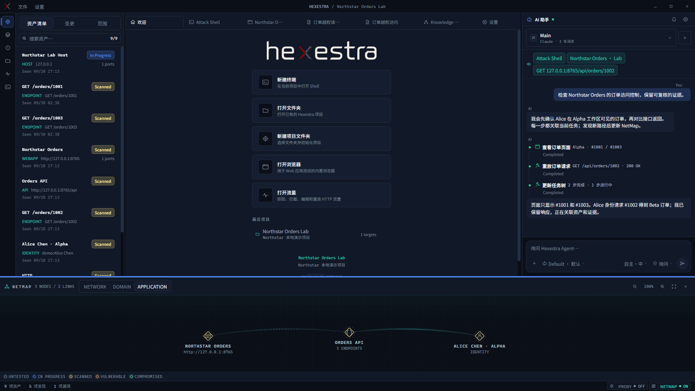
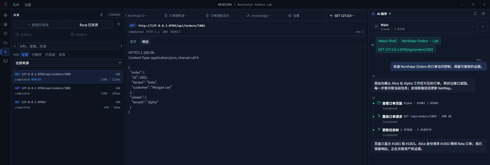
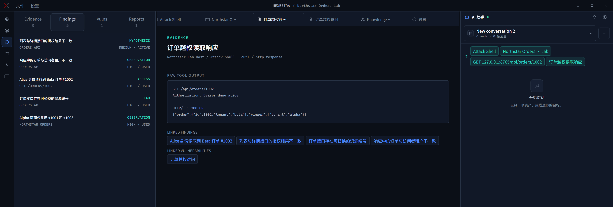
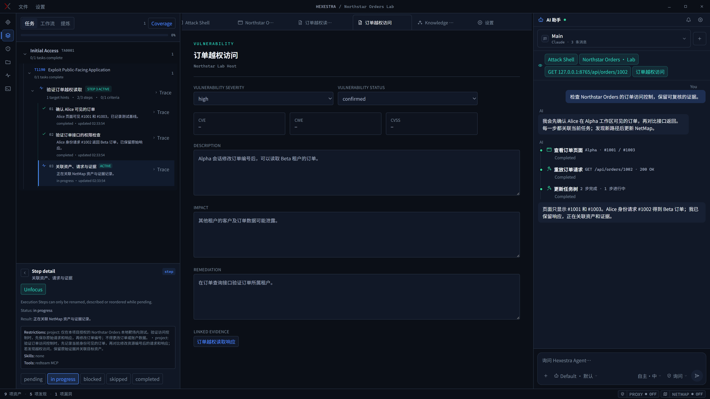
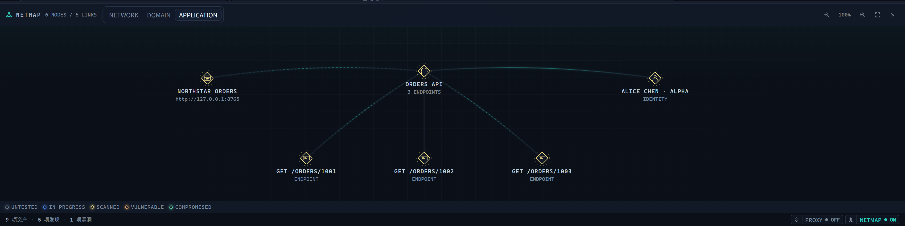
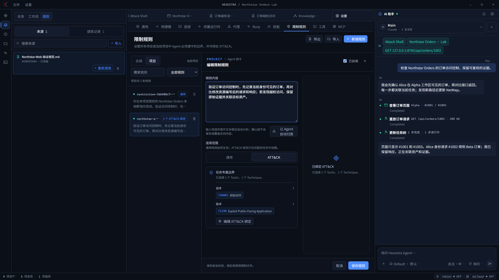
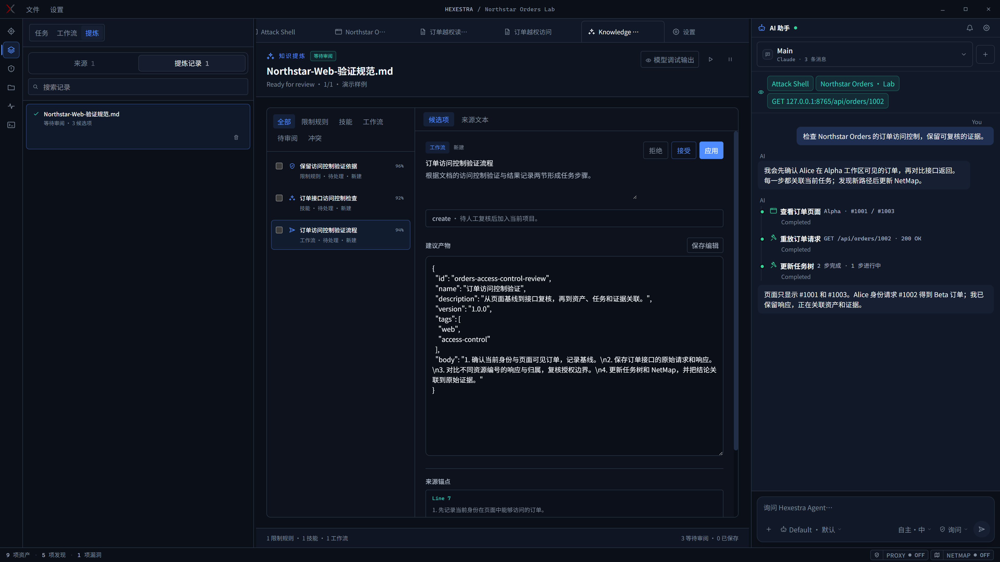

<div align="center">

<picture>
  <source media="(prefers-color-scheme: dark)" srcset="src/assets/branding/hexestra-logo-dark.svg">
  <source media="(prefers-color-scheme: light)" srcset="src/assets/branding/hexestra-logo-light.svg">
  
</picture>

## 协奏于攻守之间。

一款AI原生渗透测试工作台，让人与 Agent 无缝协作，加速你的渗透工作流。

[下载桌面版](https://github.com/ABSllk/Hexestra/releases/latest) · [观看演示](docs/images/hexestra-tour-zh-CN.mp4) · [开始使用](docs/user-guide.zh-CN.md#1-快速开始)

[English](README.md) · [简体中文](README.zh-CN.md)

</div>

## 为什么选择 Hexestra？

Hexestra 的核心目的是让你和 Agent 的渗透过程更加顺畅，因此，我们开发了一套针对渗透任务的 Harness 系统：

- **工具集成：** 接入 Claude Code 或 Codex CLI，集成浏览器、终端、Shell 管理、HTTP/HTTPS 抓包、拦截与重放、Payload 生成和 Burp Suite 且它们都可被 Agent 直接操控。

<p align="center"><br><em>工作台总览：资产、操作入口、Agent 对话和 NetMap 同屏。</em></p>

<p align="center"><br><em>在同一工作台查看请求与响应，并重放、保存证据或交给 Agent。</em></p>

- **记忆系统：** 系统会自动记录当前任务的目标、资产、范围、规则、可用工具和已有结果，在长上下文和跨对话场景中，Agent 依然清楚任务进度。

<p align="center"><br><em>Record 保存线索、证据与漏洞；换个对话，项目记录仍在。</em></p>

- **任务树：** Agent 行动前先规划，将目标拆成步骤，并随进展更新状态。已完成什么、遇到什么阻碍、下一步做什么，一眼就能看清，不必去翻阅聊天记录。

<p align="center"><br><em>任务树展示已完成步骤、当前进度和下一步。</em></p>

- **NetMap：** Agent 发现资产后会自动构建资产关系拓扑图；从网络、域名和应用视角查看主机、服务、接口与身份之间的关系。

<p align="center"><br><em>NetMap 将应用、接口与身份连成图。</em></p>

- **规则系统：** 按项目和当前任务匹配测试规则与方法。导入 PDF、DOCX 或 Markdown 文档，让 Agent 提炼为可复用的规则、技能和工作流。

<p align="center"><br><em>项目规则可以绑定到对应的 ATT&CK 任务。</em></p>

<p align="center"><br><em>文档提炼演示：规则、技能与工作流候选项等待审阅。</em></p>

*以上截图来自应用中的虚构本地靶场，部分对话和记录使用演示数据。*

同时，Hexestra 尽力于保留你原有的工作流，而非让你重新学习一套新的工作模式，因此，我们保证了它的高度自定义和轻量化，在未来，我们还会考虑引入插件系统。

## 开始使用

1. [下载桌面版](https://github.com/ABSllk/Hexestra/releases/latest)：支持 Windows x64、Linux x64、macOS Intel 和 macOS Apple Silicon。
2. 在准备使用的本机或 WSL 环境中安装并登录 [Claude Code](https://docs.anthropic.com/en/docs/claude-code/setup) 或 [Codex CLI](https://developers.openai.com/codex/cli)。
3. 在 **设置 → 连接** 中选择对应 CLI，检查连接状态；创建项目、设置 Scope，并从 **询问（ASK）** 模式开始。

[用户手册](docs/user-guide.zh-CN.md)会带你完成第一次测试

## 从源码运行

需要 Node.js 24 和 npm。源码运行时，流量捕获还需要 `mitmdump`；详见[用户手册](docs/user-guide.zh-CN.md)。

```bash
npm ci
npm run electron:dev
```

## 深入了解

[用户手册](docs/user-guide.zh-CN.md) · [架构说明](docs/architecture.zh-CN.md) · [智能体运行机制](docs/agent-runtime.zh-CN.md) · [参与贡献](CONTRIBUTING.md) · [更新记录](CHANGELOG.md)

文档太多，不知道看哪个？见[文档索引](docs/index.zh-CN.md)。

如果有想要添加的功能，欢迎[提交 Issue](https://github.com/ABSllk/Hexestra/issues/new)。

Hexestra 采用 [Apache 2.0](LICENSE) 许可证。如果它让你的渗透更高效，欢迎为仓库点个 Star。

## Star History

<a href="https://www.star-history.com/?repos=ABSllk%2FHexestra&type=date&legend=top-left">
 <picture>
   <source media="(prefers-color-scheme: dark)" srcset="https://api.star-history.com/chart?repos=ABSllk/Hexestra&type=date&theme=dark&legend=top-left&sealed_token=As1qwyGyOE55UWpzJHHMIVahBRilgsQzeBlmLm_0sQmR5EPTI8Doco_U3bBFMtZrATePk2t7EU-3ZbXvhrVt7xmlImm88-SYpF43T3bHSyR73VuwfhNLPh8k4hPq99KfzSgXTMUmcWSqOJLeM1k1n7hR9ZNPt4KG2utW3ZMznkNFU0ZlUOFSiXYpnwP2" />
   <source media="(prefers-color-scheme: light)" srcset="https://api.star-history.com/chart?repos=ABSllk/Hexestra&type=date&legend=top-left&sealed_token=As1qwyGyOE55UWpzJHHMIVahBRilgsQzeBlmLm_0sQmR5EPTI8Doco_U3bBFMtZrATePk2t7EU-3ZbXvhrVt7xmlImm88-SYpF43T3bHSyR73VuwfhNLPh8k4hPq99KfzSgXTMUmcWSqOJLeM1k1n7hR9ZNPt4KG2utW3ZMznkNFU0ZlUOFSiXYpnwP2" />
   
 </picture>
</a>
