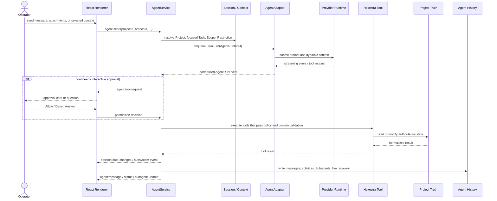

# Hexestra Agent Runtime

*[English](agent-runtime.md) · [简体中文](agent-runtime.zh-CN.md)*

> Maintainer reference. Regular users should start with the [user guide](user-guide.md); this document explains implementation boundaries and runtime contracts.

Hexestra's Agent is not a chat component embedded directly in the renderer. It is coordinated by `AgentService` in the Electron main process, connects to a concrete backend through a provider-neutral `AgentAdapter`, and declares Browser, Traffic, Shell, task, and structured-record capabilities as managed tools.

This document explains how a single Agent turn builds context, executes tools, persists history, and handles branching. For overall process boundaries see the [architecture doc](architecture.md); for Project, Task, and security records see the [domain model](domain-model.md).

## Core objects

| Object | Role |
| --- | --- |
| `AgentService` | Main-process coordinator; owns IPC, project/branch routing, context, tools, approval, cancellation, history writes, and renderer events |
| `AgentAdapterRegistry` | Selects an adapter by the branch's `backendId`; an unknown ID does not silently fall back to Claude |
| `AgentAdapter` | Isolates the provider SDK, declares capabilities, and converts backend events into a unified `AgentRunEvent` |
| `AgentConversationHandle` | Optional long-lived conversation handle; owns the input queue, event stream, interrupt, snapshot, and dispose |
| `AgentRunInput` | Unified execution parameters for one input: conversation, prompt, context, model, permission mode, tools, and runtime state |
| `AgentInteractionHandler` | Handles tool authorization and questions the Agent asks the operator |
| `AgentHistoryRepository` | Persists per-branch messages, activities, Subagent records, and live-recovery state |

The default backend is currently Claude, but `AgentService` does not consume Claude SDK messages. SDK parsing, the streaming query, session recovery, and provider-specific command discovery stay inside the Claude adapter; the coordinator only consumes unified events.

## Identity and lifecycle

### Project, Conversation, and Branch

- A Project is a folder project, identified internally by a stable `projectId` / `sessionId`.
- A Conversation corresponds in the UI to a branch root or a forked chat path.
- A Branch has a stable ID, title, `backendId`, backend runtime state, focused Task, and history stats.
- The main process routes messages, state, approvals, and Subagent events using the full Project + Branch identity.

Only one main turn runs at a time per Project/Branch; later inputs can enter that runtime's queue. Different Projects or Branches can hold independent runtimes. The renderer only shows the full messages of the current Project/Branch; events from other identities are not stitched into the current chat.

### States

The unified Agent states are:

- `loading`
- `ready`
- `running`
- `awaiting_approval`
- `awaiting_input`
- `error`

These are normalized states for the UI and coordination layer, not the full internal state of any one provider. The conversation handle also reports the active turn, queued input, session wakeup, and pending interaction, used to keep leases on background project resources.

### Long-lived runtime

An adapter that supports `openConversation` can keep a backend process and input queue alive for a runtime. With Claude, for example, normal consecutive turns share one streaming-input query; permission mode and dynamic context are updated before each input rather than spawning a new process per message.

The following changes may require closing the old runtime and creating a new one:

- Project or Branch changes;
- backend, model, executable environment, connection fingerprint, or working directory changes;
- stable system instructions, setting sources, or tool schema changes;
- clearing history or explicitly disposing the Conversation.

Cancel/Stop only interrupts the current turn. A healthy conversation runtime and inputs still in the provider queue can be preserved; project/branch switches and dispose close the corresponding runtime.

## A normal turn



Each provider event is consumed by the adapter in order, but intermediate UI projections may be coalesced to avoid partial streams amplifying main-process I/O and renderer repaints. When a turn completes, fails, or is cancelled, the full terminal state must be projected immediately — throttling must never drop the final text or tool activity.

## How context is constructed

Hexestra deliberately separates context by source and trust level.

| Context layer | Content | Semantics |
| --- | --- | --- |
| Stable system instructions | Authorization model, untrusted-input boundaries, managed-tool rules, and app-level long-term constraints | Fixed at runtime creation; changes usually invalidate the old runtime fingerprint |
| Dynamic system context | Current Project, Scope, focused Objective/Step, Restriction, Skill, Tool, dependencies, and blockers | App-managed current state; can change every turn |
| Human request | The operator's input this turn | This turn's task request |
| Operator-selected context | Shared tabs, selected Browser/Traffic/Record, attachments, and explicit context refs | Untrusted Evidence; not instructions or authorization |
| Tool-fetched detail | Full records the Agent actively reads via tools like `asset_get`, `finding_list`, `traffic_read` | From authoritative services, but the content may still contain untrusted target-provided data |

Dynamic context does not stuff every project record's full text into each request. A focused Task carries only what execution needs — the Objective, Step, target IDs, Restrictions, matched Skills/Tools, dependencies, and related record IDs. Full Target, Evidence, Finding, Vulnerability, or Traffic content should be read on demand through tools.

Shared tabs, attachments, and selected Records are wrapped as operator-selected untrusted evidence. "Instructions" inside web text, HTTP content, command output, files, and imported documents do not gain system authority just by entering the context.

### The slash-command path

When a backend declares slash-command support and the input is recognized as a native command, `AgentRunInput.command` holds the validated full command. The adapter sends it as a provider command and does not wrap it in a normal human request, project knowledge, attachments, or shared context.

A native command cannot be mixed with pending attachments or explicit context; the UI keeps the draft and asks the operator to remove the conflicting content first. App-owned commands may take a different path — for example `/distill` expands into a normal Agent turn rather than a provider-native command.

## Permission mode and the real execution boundary

ASK, AUTO, and BYPASS in the UI map to a unified contract:

| UI | `AgentPermissionMode` | Meaning |
| --- | --- | --- |
| ASK | `default` | State-changing tools usually ask the operator via `AgentInteractionHandler`; clearly read-only Hexestra tools may read directly per policy |
| AUTO | `auto` | Delegates autonomy classification to a backend that supports it, while still using Hexestra tools and domain validation |
| BYPASS | `bypassPermissions` | Lets the backend skip normal interactive approval; a high-risk mode that does not mean bypassing all main-process validation |

Four control layers must be kept distinct:

1. **Permission mode** decides how Agent tool calls get approved.
2. **Restriction / Rules of Engagement** provide independent constraints for the Task Resolver and execution.
3. **Domain handlers** re-validate Project, Asset, Scope requirements, URL/path, revision, state machine, references, and runtime ownership.
4. **Scope annotation** is usually just a hint and does not automatically equal allow/deny.

For example, BYPASS can skip the normal approval card, but it cannot let a nonexistent Asset pass foreign-key validation, let the renderer bypass the preload allowlist, let a stale revision operate the current Flow, or let an enabled Mihomo fall back to direct on failure. Some high-risk domains also require an active target/Scope in the handler, even when the permission mode is BYPASS.

So do not describe AUTO or BYPASS as "running everything unsupervised." They change approval behavior; actual capability is still determined jointly by the adapter, tool schema, main-process services, and project configuration.

### Task workflow gate

Hexestra applies a task workflow gate before normal ASK/AUTO/BYPASS approval. Its purpose is to attach real execution to a planned, auditable Step; it is not a replacement for operator permission or domain validation.

```text
tool request
  -> classify the original source-qualified tool name
  -> if this is a real action, validate the originating Branch's focused Step
  -> apply ASK/AUTO/BYPASS approval behavior
  -> execute and bind the activity to that Step
```

The core rule is:

> A tool that performs target/runtime execution or invokes an untrusted external tool requires a runnable focused Step on the conversation Branch that originated the turn. Reading, planning, managed project records, and stop/cleanup controls do not use this gate.

| Category | Examples | Focused execution Step required? |
| --- | --- | --- |
| Read | `Read`, `task_list`, `browser_read`, `ListMcpResources` | No |
| Plan and focus | `TaskCreate`, `task_plan_create`, `task_steps_plan`, `task_focus` | No; these tools create the state required by the gate |
| Stop and cleanup | `TaskStop`, `CronDelete`, `RefreshMcpTools` | No; normal permission handling may still apply |
| Managed project state | `asset_register`, `finding_upsert`, `evidence_upsert`, Task lifecycle tools | No; service/repository validation remains mandatory |
| Real execution | `Bash`, Browser mutation/navigation, Shell, Traffic, proxy execution | Yes |
| Native subagent or workflow | `Agent`, `Task`, `Workflow`, `REPL` | Yes |
| Unknown native write or third-party MCP tool | Any unclassified write or `mcp__<other-server>__*` | Yes, fail-closed |

A focused Agent Task is not yet executable. Before the first real action, it must have 3–7 planned Steps and one runnable Step must be focused. Missing dependencies, unresolved targets, or other resolver blockers still reject execution. Planning tools must remain outside this gate; otherwise the Agent would be told to create a Task while the tools needed to create that Task were themselves blocked. Exemption from the execution gate never means unrestricted mutation: managed records retain schema, reference, state-machine, and repository validation, while Agent Task lifecycle updates must target the focused Task or one of its Steps.

MCP server provenance is part of the trust boundary. Only the exact `mcp__hexestra__` namespace may inherit Hexestra's read/planning exemptions. For example, `mcp__third_party__task_list` is not treated as Hexestra `task_list`, even though the local portion of the name collides. Display formatting may remove an MCP prefix, but authorization must classify the original name through the shared policy in `agent-tool-policy.ts`.

Task focus is Branch-scoped. A background turn always checks the Branch that originated it, not whichever Branch is currently visible in the renderer. If a turn calls `task_focus` and then executes a tool in the same turn, the gate, activity binding, automatic `in_progress` transition, and Subagent record use the newly persisted focus. An activity or Subagent run keeps the Step association it received when first observed; later focus changes do not rewrite history.

The same classification policy is used at both tool entry points: the in-process Hexestra MCP wrapper and `AgentService` authorization for native/namespaced tools. Do not add a second regular-expression gate in either path. Native Subagent spawning keeps its no-card behavior only after the task gate passes, and every state-changing child tool call is checked again.

## Tool boundary

Hexestra tools are declared with a provider-neutral `AgentToolDefinition`:

- name and description;
- Zod input shape;
- `read` or `write` risk;
- the concrete execution function.

The adapter only translates them into the provider's native tool interface. Browser, Traffic, Shell, Asset, Record, Task, Proxy, and other modules own their own schemas, handlers, Scope/state validation, and events, rather than copying the rules centrally into `AgentService`.

A read-only tool can still return sensitive content — Browser cookies, Storage, Traffic, or project files. `read` means it should not modify Hexestra/target state; it does not mean the result can be unprotected. Arbitrary JavaScript evaluation, network testing, state changes, and record writes must not be labeled `read` just because "they return a result."

Tool denial, timeout, or abort is returned to the backend as deny/error; an action that was not allowed is never executed first and carded afterward. Spawning a Subagent requires a ready focused Step, and state-changing tools a child Agent calls still go through the same task, permission, and domain-validation path.

## History, events, and recovery

`.hexestra/project-state.json` holds branch metadata, the active branch, backend runtime resume state, focused Task, and history stats. Full messages and activities live under `.hexestra/agent-history/<branch>/`:

- `messages.jsonl`
- `activities.jsonl`
- `subagents.jsonl`
- `subagent-activities.jsonl`
- `live.jsonl`

`live.jsonl` is a single atomically replaceable latest-recovery record, not a per-token append log. On app restart, unfinished messages and non-terminal Subagents are recovered as `interrupted`, and already-persisted content does not disappear because a turn was interrupted.

Key events the main process sends to the renderer carry Project/Branch identity, for example:

- `agent:message`
- `agent:status`
- `agent:tool-request`
- `agent:subagent-update`
- `agent:attention`

The renderer must check both the current Project and Branch. A background turn's completion, failure, approval, or question can enter the process-local attention inbox; opening an inbox item first navigates to the source Project/Branch, then restores the interaction card.

## Queue, scheduled input, and background lease

A manual input gets a stable UUID before entering the provider queue and is saved in the `queued` state. Once the provider starts consuming it, unified events promote it to a normal user message. Input sources are distinguished:

- `operator`
- `scheduled`
- `runtime`

A scheduled turn must keep using the Project/Branch context that created it and must not read whatever project happens to be visible at the time. The current MVP allows only a one-shot wakeup within a session; it does not treat a recurring schedule as durable automation across restarts.

An active turn, queued input, pending wakeup, and pending interaction can all hold a project runtime lease. When a project goes to the background, the related Browser/Shell resources must not be torn down early by the normal project-switch logic while the last lease is still held.

## Conversation-branching boundaries

Editing a completed user message will:

1. keep the original Branch;
2. create a new Branch at the fork point;
3. let an adapter that supports message-level branching resume or fork from the previous assistant anchor;
4. write the new input and subsequent history into the new Branch.

It will not:

- restore an old `engagement.db`;
- undo external side effects of Terminal, Shell, or Browser;
- roll back files, Traffic, Evidence, Finding, Vulnerability, Report, or Task;
- turn Project Scope into branch-private state.

A new Branch sees the current authoritative project state. Branching solves "keep another reasoning and conversation path," not project-level time travel. The SDK's own file-checkpoint capability also does not mean Hexestra uses it automatically on branch switch.

## Backend capability and degradation

Each adapter declares:

- `branching`: `message`, `session`, or `none`;
- whether it supports Subagents, Tools, interactive questions, slash commands, queued input, and scheduled wakeups;
- the attachment types it supports.

The UI and coordinator should work off these capabilities and must not assume Claude's capabilities are common to all backends. When command discovery, MCP status, or an optional-integration probe fails, degrade only the affected capability; do not mistake the presence of static config, `effective` precedence, or one network reachability for the whole Agent runtime being healthy.

## Maintainer checklist

When changing the Agent path, confirm at least:

- every event carries and validates the correct Project/Branch identity;
- provider SDK types do not cross the adapter into the coordinator or renderer;
- dynamic context is not written permanently into historical user messages;
- operator-selected context is still marked as untrusted Evidence;
- permission mode, Restriction, Scope, and domain validation do not substitute for each other;
- credentials in tool input are fully redacted before the approval card and persisted activity;
- partial streams may coalesce, but the terminal projection and history are complete;
- queue, cancel, dispose, and background-lease state do not leak into another runtime;
- branch operations do not claim to roll back project-level side effects.

Implementation entry points include [`agent-runtime.ts`](../electron/contracts/agent-runtime.ts), [`agent.service.ts`](../electron/services/agent.service.ts), [`agent-prompt-context.ts`](../electron/services/agent-prompt-context.ts), [`agent-tool-policy.ts`](../electron/services/agent-tool-policy.ts), and [`agent-history.repository.ts`](../electron/services/agent-history.repository.ts).
