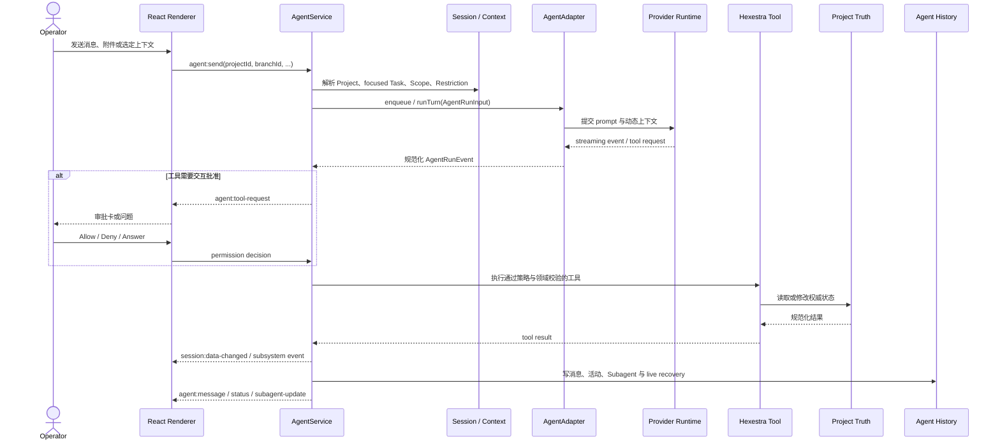

# Hexestra Agent 运行机制

*[English](agent-runtime.md) · [简体中文](agent-runtime.zh-CN.md)*

> 维护者参考。普通用户请先阅读[使用指南](user-guide.zh-CN.md)；本文解释实现边界和运行时契约。

Hexestra 的 Agent 不是一个直接嵌入 Renderer 的聊天组件。它由 Electron Main Process 中的
`AgentService` 协调，通过 provider-neutral `AgentAdapter` 接入具体后端，并把 Browser、Traffic、
Shell、任务和结构化记录能力声明为受管工具。

本文解释一次 Agent turn 如何构造上下文、执行工具、持久化历史和处理分支。整体进程边界见
[架构文档](architecture.zh-CN.md)，Project、Task 与安全记录见[领域模型](domain-model.zh-CN.md)。

## 核心对象

| 对象 | 作用 |
| --- | --- |
| `AgentService` | Main Process 协调器；拥有 IPC、项目/分支路由、上下文、工具、审批、取消、历史写入和 Renderer 事件 |
| `AgentAdapterRegistry` | 按 Branch 的 `backendId` 选择适配器；未知 ID 不会静默回退到 Claude |
| `AgentAdapter` | 隔离 provider SDK，声明能力并把后端事件转换为统一的 `AgentRunEvent` |
| `AgentConversationHandle` | 可选的长生命周期对话句柄；负责输入队列、事件流、interrupt、snapshot 和 dispose |
| `AgentRunInput` | 一次输入的统一执行参数：conversation、prompt、上下文、模型、permission mode、工具和 runtime state |
| `AgentInteractionHandler` | 处理工具授权和 Agent 向操作员提出的问题 |
| `AgentHistoryRepository` | 按 Branch 保存消息、活动、Subagent 记录和 live recovery 状态 |

当前默认后端是 Claude，但 `AgentService` 不消费 Claude SDK message。SDK 解析、streaming query、
session 恢复和 provider-specific command discovery 留在 Claude adapter 内；协调器只消费统一事件。

## 身份与生命周期

### Project、Conversation 与 Branch

- Project 是文件夹项目，内部由稳定 `projectId` / `sessionId` 标识。
- Conversation 在界面上对应一个 Branch 根或分叉后的聊天路径。
- Branch 有稳定 ID、标题、`backendId`、后端 runtime state、focus Task 和历史统计。
- Main Process 使用完整的 Project + Branch 身份路由消息、状态、审批和 Subagent 事件。

同一个 Project/Branch 同时只执行一个 main turn；后续输入可进入该 runtime 的队列。不同 Project
或 Branch 可以拥有独立 runtime。Renderer 只展示当前 Project/Branch 的完整消息，来自其他身份的
事件不会被拼入当前聊天。

### 状态

统一 Agent 状态包括：

- `loading`
- `ready`
- `running`
- `awaiting_approval`
- `awaiting_input`
- `error`

这些是 UI 和协调层的规范化状态，不等同于某个 provider 的全部内部状态。Conversation handle
还报告 active turn、queued input、session wakeup 和 pending interaction，用于保持后台项目资源的
lease。

### 长生命周期 runtime

支持 `openConversation` 的 adapter 可以为一个 runtime 保留后端进程和输入队列。以 Claude 为例，
普通连续 turn 共用 streaming-input query；每次输入前更新 permission mode 和动态上下文，而不是
为每条消息都创建新进程。

以下变化可能要求关闭旧 runtime 并创建新的：

- Project 或 Branch 改变；
- 后端、模型、可执行环境、连接 fingerprint 或工作目录改变；
- Stable System instructions、setting sources 或 tool schema 改变；
- 清空历史或显式销毁 Conversation。

Cancel/Stop 只 interrupt 当前 turn。健康的 Conversation runtime 和尚在 provider queue 中的输入
可以保留；项目/分支切换与 dispose 则关闭对应 runtime。

## 一次普通 turn



每个 provider event 都会按顺序被 adapter 消费，但中间 UI projection 可以合并，以避免 partial
stream 造成主进程 I/O 和 Renderer 重绘放大。Turn 完成、失败或取消时必须立即投影完整终态，不能
因为节流而丢失最终文本或工具活动。

## 上下文是如何构造的

Hexestra 刻意区分不同来源和信任等级的上下文。

| 上下文层 | 内容 | 语义 |
| --- | --- | --- |
| Stable System instructions | 授权模型、非可信输入边界、受管工具规则和应用级长期约束 | runtime 创建时固定；变更通常使旧 runtime fingerprint 失效 |
| Dynamic System context | 当前 Project、Scope、focused Objective/Step、Restriction、Skill、Tool、依赖与 blocker | 应用管理的当前状态；每个 turn 可变化 |
| Human request | 操作员本次输入 | 本次任务请求 |
| Operator-selected context | 共享 tab、选中的 Browser/Traffic/Record、附件与显式 context ref | 非可信 Evidence；不是指令或授权 |
| Tool-fetched detail | Agent 通过 `asset_get`、`finding_list`、`traffic_read` 等工具主动读取的完整记录 | 来自权威服务，但内容仍可能包含目标提供的非可信数据 |

Dynamic context 不把所有项目记录全文塞进每个请求。Focused Task 只携带执行所需的 Objective、
Step、目标 ID、Restriction、匹配 Skill/Tool、依赖和相关记录 ID。完整 Target、Evidence、Finding、
Vulnerability 或 Traffic 内容应按需通过工具读取。

共享 tab、附件和 selected Record 被包装为 operator-selected untrusted evidence。网页文字、HTTP
内容、命令输出、文件和导入文档中的“指令”不会因为进入上下文就获得 System authority。

### Slash command 的特殊路径

当 backend 声明支持 slash command 且输入被识别为原生命令时，`AgentRunInput.command` 保存经过
验证的完整命令。Adapter 将其作为 provider command 发送，不再包入普通 human request、项目知识、
附件或共享上下文。

原生命令不能与待发送附件或显式上下文混合；界面会保留草稿并要求操作员先移除冲突内容。
应用自有命令可以选择不同路径，例如 `/distill` 会展开成一次普通 Agent turn，而不是 provider
原生命令。

## Permission mode 与真正的执行边界

UI 中的 ASK、AUTO 和 BYPASS 映射到统一 contract：

| UI | `AgentPermissionMode` | 含义 |
| --- | --- | --- |
| ASK | `default` | 状态改变类工具通常通过 `AgentInteractionHandler` 请求操作员决定；明确的只读 Hexestra 工具可按策略直接读取 |
| AUTO | `auto` | 将自主分类交给支持该模式的后端，同时仍使用 Hexestra 工具与领域校验 |
| BYPASS | `bypassPermissions` | 允许后端跳过普通交互批准；这是高风险模式，不表示绕过所有 Main Process 校验 |

必须区分四层控制：

1. **Permission mode** 决定 Agent 工具调用如何获得批准。
2. **Restriction / Rules of Engagement** 为 Task Resolver 和执行提供独立约束。
3. **领域 handler** 重新验证 Project、Asset、Scope 要求、URL/路径、revision、状态机、引用和运行时所有权。
4. **Scope annotation** 通常只是提示，不自动等于 allow/deny。

例如 BYPASS 可以跳过普通 approval card，但不能让不存在的 Asset 通过外键校验、让 Renderer
越过 Preload 白名单、让过期 revision 操作当前 Flow，或让启用的 Mihomo 在失败时回退直连。
部分高风险领域还会在 handler 中要求 active target/Scope，即使 permission mode 是 BYPASS。

因此不要把 AUTO 或 BYPASS 描述为“无人监管地执行一切”。它们改变审批行为，实际能力仍由
adapter、tool schema、Main Process 服务和项目配置共同决定。

### Task 工作流门禁

Hexestra 在普通 ASK/AUTO/BYPASS 审批之前执行 Task 工作流门禁。它用于把真实执行挂到一个经过
规划、可审计的 Step 上，不能替代操作员审批或领域校验。

```text
工具请求
  -> 使用保留来源信息的原始工具名进行分类
  -> 如果是真实动作，检查发起该 turn 的 Branch 所聚焦的 Step
  -> 应用 ASK/AUTO/BYPASS 审批行为
  -> 执行，并把活动绑定到该 Step
```

核心规则是：

> 会执行目标/运行时动作或调用不受信任外部工具的请求，必须在发起该 turn 的对话 Branch 上聚焦
> 一个可执行 Step；读取、规划、受管项目记录以及停止/清理控制不使用这道门禁。

| 类别 | 示例 | 是否要求聚焦执行 Step |
| --- | --- | --- |
| 读取 | `Read`、`task_list`、`browser_read`、`ListMcpResources` | 否 |
| 规划与聚焦 | `TaskCreate`、`task_plan_create`、`task_steps_plan`、`task_focus` | 否；这些工具负责建立门禁所需状态 |
| 停止与清理 | `TaskStop`、`CronDelete`、`RefreshMcpTools` | 否；仍可能进入普通 permission 处理 |
| 受管项目状态 | `asset_register`、`finding_upsert`、`evidence_upsert`、Task lifecycle 工具 | 否；仍必须通过 service/repository 校验 |
| 真实执行 | `Bash`、Browser 导航/修改、Shell、Traffic、代理执行 | 是 |
| 原生 Subagent 或工作流 | `Agent`、`Task`、`Workflow`、`REPL` | 是 |
| 未知原生写工具或第三方 MCP | 未分类 write，或任意 `mcp__<other-server>__*` | 是，默认从严 |

仅聚焦 Agent Task 还不能执行。首次真实动作前，Task 必须已经规划 3–7 个 Step，并聚焦其中一个
可运行 Step；依赖缺失、目标未解析或其他 resolver blocker 仍会拒绝执行。规划工具必须位于该门禁
之外，否则系统会要求 Agent 先创建 Task，同时又拦截创建 Task 所需的工具，形成死锁。免除执行
门禁不代表可以任意修改：受管记录仍接受 schema、引用、状态机和 repository 校验，Agent Task
lifecycle 更新则只能指向当前聚焦 Task 或它的某个 Step。

MCP server 来源是信任边界的一部分。只有精确的 `mcp__hexestra__` namespace 可以继承 Hexestra
的只读/规划豁免。例如 `mcp__third_party__task_list` 即使本地名称相同，也不能作为 Hexestra
`task_list`。展示层可以去掉 MCP 前缀，但授权必须把原始名称交给 `agent-tool-policy.ts` 中的共享
策略分类。

Task focus 按 Branch 隔离。后台 turn 始终检查发起它的 Branch，不能读取 Renderer 当前恰好显示的
Branch。如果一个 turn 先调用 `task_focus` 再执行工具，门禁、活动绑定、自动 `in_progress` 转换和
Subagent 记录都使用刚持久化的新 focus。Activity 或 Subagent run 首次关联 Step 后必须保持稳定，
后续 focus 改变不能重写历史。

两个工具入口必须使用同一个分类策略：进程内 Hexestra MCP wrapper，以及 `AgentService` 对原生/
namespaced 工具的授权。不能在两个入口分别维护正则门禁。原生 Subagent spawn 只有在 Task 门禁通过
后才保留不弹 approval card 的行为，子 Agent 的每个状态改变工具仍会重新经过门禁。

## Tool 边界

Hexestra tool 使用 provider-neutral `AgentToolDefinition` 声明：

- 名称和说明；
- Zod input shape；
- `read` 或 `write` risk；
- 具体执行函数。

Adapter 只负责翻译为 provider 原生工具接口。Browser、Traffic、Shell、Asset、Record、Task、Proxy
等模块拥有各自 schema、handler、Scope/状态校验和事件，不把规则集中复制到 `AgentService`。

只读工具仍可能返回敏感内容，例如 Browser cookie、Storage、Traffic 或项目文件。`read` 表示不应
修改 Hexestra/目标状态，不表示结果可以不受保护。任意 JavaScript evaluation、网络测试、状态
改变和记录写入都不应仅因为“会返回结果”就标成 read。

工具拒绝、timeout 或 abort 会作为 deny/error 返回给后端；没有获得允许的动作不会先执行再补卡片。
Subagent spawn 需要已经聚焦可执行 Step，子 Agent 调用的状态改变工具仍走同一 Task、permission
与领域校验路径。

## 历史、事件与恢复

`.hexestra/project-state.json` 保存 Branch 元数据、active Branch、backend runtime resume state、
focused Task 和历史统计。完整消息与活动位于 `.hexestra/agent-history/<branch>/`：

- `messages.jsonl`
- `activities.jsonl`
- `subagents.jsonl`
- `subagent-activities.jsonl`
- `live.jsonl`

`live.jsonl` 是一条可原子替换的最新恢复记录，不是每个 token 都追加的日志。应用重启时，未完成
消息和非终态 Subagent 会恢复为 `interrupted`，已持久化内容不会因为 turn 中断而消失。

Main Process 向 Renderer 发送的关键事件带 Project/Branch 身份，例如：

- `agent:message`
- `agent:status`
- `agent:tool-request`
- `agent:subagent-update`
- `agent:attention`

Renderer 必须同时检查当前 Project 和 Branch。后台 turn 的完成、失败、approval 或 question 可以进入
process-local attention inbox；打开 inbox item 时先导航到来源 Project/Branch，再恢复交互卡片。

## Queue、scheduled input 与后台 lease

手动输入在进入 provider queue 前获得稳定 UUID，并以 `queued` 状态保存。Provider 开始消费后，
统一事件把它推进为普通 user message。输入来源区分：

- `operator`
- `scheduled`
- `runtime`

Scheduled turn 必须继续使用创建它的 Project/Branch 上下文，不能读取当时恰好可见的项目。当前 MVP
只允许 session 内的一次性 wakeup；不把 recurring schedule 当作跨重启的 durable automation。

Active turn、queued input、pending wakeup 和 pending interaction 都可以持有项目 runtime lease。
项目退到后台时，只要最后一个 lease 尚未释放，相关 Browser/Shell 资源就不能按普通项目切换逻辑
提前销毁。

## Conversation branching 的边界

编辑已完成的 user message 会：

1. 保留原 Branch；
2. 在分叉点创建新 Branch；
3. 让支持 message-level branching 的 adapter 从前一条 assistant anchor 恢复或 fork；
4. 将新输入与之后的历史写入新 Branch。

它不会：

- 恢复旧版 `engagement.db`；
- 撤销 Terminal、Shell 或 Browser 的外部副作用；
- 回滚文件、Traffic、Evidence、Finding、Vulnerability、Report 或 Task；
- 把 Project Scope 变成 Branch 私有状态。

新 Branch 看到的是当前项目权威状态。分支解决的是“保留另一条推理和对话路径”，不是项目级
time travel。SDK 自带的文件 checkpoint 能力也不等于 Hexestra 会在 Branch 切换时自动使用它。

## Backend capability 与降级

每个 adapter 声明：

- `branching`: `message`、`session` 或 `none`；
- 是否支持 Subagent、Tool、interactive question、slash command、queued input 和 scheduled wakeup；
- 支持的 attachment 类型。

UI 和协调器应按这些 capability 工作，不应把 Claude 的能力假定为所有 backend 的公共能力。
当 command discovery、MCP status 或可选集成探测失败时，只降级对应能力；不能把静态配置存在、
`effective` precedence 或某次网络可达误报为整个 Agent runtime 已健康。

## 维护者检查清单

修改 Agent 路径时，至少确认：

- 每个事件都携带并校验正确的 Project/Branch 身份；
- provider SDK 类型没有越过 adapter 进入协调器或 Renderer；
- dynamic context 不被永久写进历史 user message；
- operator-selected context 仍标记为非可信 Evidence；
- permission mode、Restriction、Scope 和领域校验没有互相替代；
- tool input 中的凭据在 approval card 和持久化活动之前已被完整 redaction；
- partial stream 可合并，但 terminal projection 与 history 完整；
- queue、cancel、dispose 和 background lease 的状态不会串到其他 runtime；
- Branch 操作不会声称回滚项目级副作用。

实现入口包括 [`agent-runtime.ts`](../electron/contracts/agent-runtime.ts)、
[`agent.service.ts`](../electron/services/agent.service.ts)、
[`agent-prompt-context.ts`](../electron/services/agent-prompt-context.ts)、
[`agent-tool-policy.ts`](../electron/services/agent-tool-policy.ts) 和
[`agent-history.repository.ts`](../electron/services/agent-history.repository.ts)。
