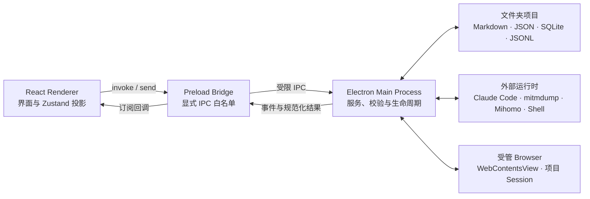

# Hexestra 架构

> 维护者参考。普通用户请先阅读[使用指南](user-guide.md)。

Hexestra 是一个以文件夹项目为持久化边界的 Electron 桌面应用。其中 React
Renderer 做为前端负责工作台交互，Electron Main Process 做为后端负责文件系统、数据库、进程、网络、
凭据和 Agent 运行时等高权限能力，Preload 做为中间层通过显式白名单在两者之间建立 IPC 边界。

这篇文档回答三个问题：系统由哪些部分组成，权威状态放在哪里，以及一次操作如何跨越这些组件。
核心记录之间的关系见[领域模型](domain-model.md)，Agent 的执行细节见
[Agent 运行机制](agent-runtime.md)。

## 总体结构



由图可见，这并不仅仅是一个前端项目，前端也不能直接控制系统底层，因此 React Renderer 不能导入 Node.js 或 Electron 高权限 API，也不拥有数据库连接、PTY、SSH socket、浏览器 `webContents` 或 Agent SDK 对象。它通过 `window.hexestra` 调用 Preload 暴露的少量通用方法；Preload 再校验 channel 是否位于 `INVOKE_CHANNELS` 或 `EVENT_CHANNELS` 白名单中。

### 三个进程边界

| 边界 | 主要职责 | 不应该承担的职责 |
| --- | --- | --- |
| React Renderer | 工作台布局、输入草稿、交互状态、当前项目的 Zustand 投影 | 直接写项目数据库、持有凭据、创建本地进程或把投影当作持久化真相 |
| Preload Bridge | 暴露 `invoke`、`on`、`once`、`send`，阻止未知 IPC channel | 实现业务逻辑、补做主进程校验或向页面暴露任意 Electron API |
| Electron Main Process | 项目身份、持久化、业务校验、进程与网络资源、Agent 协调、事件发布 | 把 SDK 私有对象或敏感配置原样发送给 Renderer |

入口可从 [`electron/main.ts`](../electron/main.ts)、
[`electron/preload.ts`](../electron/preload.ts) 和
[`src/components/layout/AppShell.tsx`](../src/components/layout/AppShell.tsx) 开始阅读。

## 主要子系统

Main Process 中的服务按能力边界组织。

| 子系统 | 权威职责 | 代表性入口 |
| --- | --- | --- |
| 项目与 Session | 打开文件夹、稳定项目 ID、Recent 引用、项目元数据、文件与任务投影 | [`session.service.ts`](../electron/services/session.service.ts)、[`project-registry.ts`](../electron/services/project-registry.ts) |
| 项目工作区状态 | 对话分支元数据、偏好、可恢复 tab、Traffic/Proxy/Shell 配置的规范化与迁移 | [`project-state.ts`](../electron/services/project-state.ts) |
| 资产图与记录 | Asset、关系、Evidence、Finding、Vulnerability、Report 及 NetMap 布局 | [`asset-graph.repository.ts`](../electron/services/asset-graph.repository.ts) |
| Agent | 后端适配、上下文构造、工具权限、队列、事件、历史与对话分支 | [`agent.service.ts`](../electron/services/agent.service.ts)、[`agent-runtime.ts`](../electron/contracts/agent-runtime.ts) |
| Browser | 项目隔离的 Electron Session、`WebContentsView`、Playwright/CDP 自动化 | [`browser.service.ts`](../electron/services/browser.service.ts) |
| Traffic | mitmdump 生命周期、Flow、拦截、Replay、项目 CA 与可选 Burp 镜像 | [`traffic.service.ts`](../electron/services/traffic.service.ts) |
| Terminal 与 Shell | 本地 PTY、WSL、SSH、WebShell、反向连接、租约和审计 | [`terminal.service.ts`](../electron/services/terminal.service.ts)、[`shell.service.ts`](../electron/services/shell.service.ts) |
| 出口代理 | Mihomo 节点保险库、链配置、运行时和 fail-closed 路由投影 | [`egress-proxy.service.ts`](../electron/services/egress-proxy.service.ts) |
| Workflow 与用户能力 | Workflow、Restriction、Skill、Tool Catalog 和 Knowledge Refinery | [`workflow.service.ts`](../electron/services/workflow.service.ts)、[`knowledge-refinery.service.ts`](../electron/services/knowledge-refinery.service.ts) |

Renderer 使用多个 Zustand store 保存当前视图所需的投影，例如 Session、NetMap、任务树、
聊天和 tab。Store 的职责是加载、筛选和协调 UI，它并不直接保存任何状态。一次写操作通常先通过 IPC 在 Main Process 中完成，再由 Renderer 重载受影响的投影。

## 文件夹项目与持久化

用户选择的文件夹就是项目根目录。稳定项目 ID 存放于 `.hexestra/project.json`；Recent
列表只保存项目路径引用，删除 Recent 项不会删除项目文件。

一个项目的关键结构如下：

```text
<project>/
├── ptt.md                         # 可读、可编辑的 PTT 任务树
├── targets.md                     # Host/Target 的可读投影
├── targets/                       # 项目初始化时保留的可读目录
├── .claude/skills/                # 为当前项目释放的 Agent Skill 运行时副本
└── .hexestra/
    ├── project.json               # 项目身份、Scope 与摘要计数
    ├── project-state.json         # 对话分支元数据、偏好与工作区恢复信息
    ├── engagement.db              # Asset Graph 与受管安全记录
    ├── agent-history/             # 分支消息、活动与 Subagent JSONL 历史
    ├── traffic/                   # Traffic Flow 的可读权威记录与可重建索引
    ├── replay/                    # Repeater Session 与尝试
    ├── shell/                     # Shell 审计及相关索引
    └── user/                      # 项目级 Restriction 与 Skill 来源
```

其中：

- `project.json` 拥有项目身份和项目级元数据。
- `ptt.md` 储存任务树，任务操作必须通过共享解析与校验路径写回它。
- `engagement.db` 储存 Asset Graph、布局和 Evidence/Finding/Vulnerability/Report 。
- `project-state.json` 保存恢复工作区所需的轻量状态，不保存数据库记录、终端输出、浏览器页面或凭据。
- `agent-history/` 保存对话消息、活动和 Subagent 历史；分支元数据仍由 `project-state.json` 管理。
- Traffic、Replay 和 Shell 按各自的生命周期维护专用记录；其 Renderer 状态仍然只是投影。

应用级设置、Recent 引用和加密凭据可能位于 Electron `userData` 或 Hexestra 用户目录，
它们不属于某个文件夹项目。项目 JSON 中只保存安全的引用或公开配置，不保存 Mihomo 节点密钥、
SSH 私钥或活跃 socket。

## 三条典型数据流

### 打开项目

1. Renderer 调用 `project:open-folder`、`project:create-folder` 或 `project:open-recent`。
2. Main Process 读取或初始化 `.hexestra/project.json`，验证稳定 ID 与路径关系。
3. Session 服务只创建缺少的标准文件，打开 SQLite 与 Agent History，并协调计数。
4. Renderer 将项目设为当前项目，然后并行加载 Targets、NetMap、Tasks、Records、Files 和工作区状态。
5. 每个异步结果提交前再次检查 `sessionId`，避免项目切换后的旧结果污染新项目。

### 修改结构化记录

以保存 Finding 为例：

1. Renderer 调用 `findings:upsert`，或者 Agent 调用对应的 Hexestra 工具。
2. Main Process 校验记录和所有引用，在 `engagement.db` 中完成写入。
3. 服务发布带 `sessionId` 和受影响 flags 的 `session:data-changed`。
4. 当前项目的 Renderer 重新加载 Findings；如果影响风险计数或 NetMap，也重新加载相关投影。

事件传递的是“哪些投影已失效”，不是让 Renderer 直接拼接一条数据库变更。这样 UI、Agent 和
外部文件变化仍共享同一权威读取路径。

### 使用实时能力

Browser、Traffic、Terminal、Shell、Agent 和 Mihomo 都包含进程内或进程外的实时资源。
Main Process 为它们维护项目归属、状态机、revision、租约和清理逻辑；Renderer 接收的是规范化
状态与事件。切换 tab 不等于销毁资源，切换项目也不能在仍有后台 Agent lease 时误删该项目所需的
Browser 或 Shell 资源。

## 控制边界

Hexestra 同时存在多种“允许、提示、阻止”机制，不能混为一个开关。

| 机制 | 作用 | 是否单独构成授权 |
| --- | --- | --- |
| Preload allowlist | 限定 Renderer 可以发起或订阅的 IPC channel | 否；Main Process 仍必须验证参数、归属和状态 |
| Scope | 为 Asset、Target、Browser 和 Agent 提供 `included`、`unlisted`、`excluded` 等提示 | 否；Scope 通常不阻断命令或流量 |
| ASK/AUTO/BYPASS | 改变 Agent 工具审批模式 | 否；不能替代项目授权、Rules of Engagement 或领域校验 |
| Restriction / Rules of Engagement | 为任务解析与 Agent 执行提供独立约束 | 是控制输入之一，但仍由具体执行路径落实 |
| 领域校验 | 检查 project/session 归属、revision、状态机、Scope 要求、路径、URL、引用完整性等 | 是；在 Main Process 或受管工具处理器中执行 |
| fail-closed 路由 | 代理启用而链路失效时阻止受管出口回退直连 | 是；仅覆盖明确列出的受管流量 |

因此，“Preload 中存在一个 channel”“界面显示 OUT”“选择 BYPASS”都不能单独说明某项操作
一定会执行。要判断真实边界，必须追踪到对应 Main Process handler 和领域服务。

## 维护者如何定位问题

遇到跨层行为时，按下面顺序调查通常最快：

1. 从 [`electron/preload.ts`](../electron/preload.ts) 确认 IPC 名称和暴露方向。
2. 在 `electron/services/` 搜索 handler，确认 Main Process 的校验、持久化和事件。
3. 在 `electron/contracts/` 与 `src/types/` 核对跨层数据结构。
4. 在 `src/stores/` 查找加载、项目/分支身份检查与投影更新。
5. 在 `src/components/` 查找可见交互和瞬态草稿。
6. 在 `test/` 搜索 channel、contract 或服务名，区分设计行为与偶然实现。

以下判断可以帮助避免常见误区：

- UI 不刷新不一定表示持久化失败；先确认权威写入与 invalidation event。
- UI 显示正确不代表数据已持久化；确认写操作是否经过 Main Process。
- 对话分支切换只改变聊天投影和后端恢复状态，不回滚项目文件或结构化记录。
- 终端、浏览器或工具输出默认是非可信 Evidence，不会被静默解析成 Asset Graph 变更。
- 可选集成失败不应让无关核心能力进入错误状态，除非该集成本来就在受管执行路径上。

## 继续阅读

- [领域模型](domain-model.md)：Project、Scope、Asset、Task 与安全记录如何关联。
- [Agent 运行机制](agent-runtime.md)：上下文、审批、队列、事件、持久化与分支语义。
- [贡献指南](../CONTRIBUTING.md)：开发环境、质量门和 Pull Request 要求。
