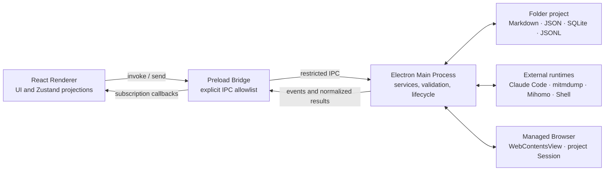

# Hexestra Architecture

*[English](architecture.md) · [简体中文](architecture.zh-CN.md)*

> Maintainer reference. Regular users should start with the [user guide](user-guide.md).

Hexestra is an Electron desktop app whose persistence boundary is a folder project. The React renderer is the front end and owns workbench interaction; the Electron main process is the back end and owns high-privilege capabilities — filesystem, databases, processes, network, credentials, and the agent runtime; the preload layer sits between them and establishes the IPC boundary through an explicit allowlist.

This document answers three questions: what the system is made of, where authoritative state lives, and how a single operation crosses those components. For how the core records relate, see the [domain model](domain-model.md); for agent execution detail, see the [agent runtime](agent-runtime.md).

## Overall structure



As the diagram shows, this is not merely a front-end project, and the front end cannot control the system directly. The React renderer must not import Node.js or high-privilege Electron APIs, and it does not own database connections, PTYs, SSH sockets, the browser's `webContents`, or Agent SDK objects. It calls the small set of generic methods the preload exposes via `window.hexestra`; the preload then checks that the channel is in the `INVOKE_CHANNELS` or `EVENT_CHANNELS` allowlist.

### The three process boundaries

| Boundary | Primary responsibilities | What it must not do |
| --- | --- | --- |
| React Renderer | Workbench layout, input drafts, interaction state, Zustand projections of the current project | Write the project database directly, hold credentials, spawn local processes, or treat a projection as persistent truth |
| Preload Bridge | Expose `invoke`, `on`, `once`, `send`; block unknown IPC channels | Implement business logic, re-do main-process validation, or expose arbitrary Electron APIs to the page |
| Electron Main Process | Project identity, persistence, business validation, process and network resources, agent coordination, event publishing | Send SDK-private objects or sensitive config to the renderer as-is |

Good starting points are [`electron/main.ts`](../electron/main.ts), [`electron/preload.ts`](../electron/preload.ts), and [`src/components/layout/AppShell.tsx`](../src/components/layout/AppShell.tsx).

## Main subsystems

Services in the main process are organized by capability boundary.

| Subsystem | Authoritative responsibility | Representative entry point |
| --- | --- | --- |
| Project & Session | Open folder, stable project ID, Recent references, project metadata, file and task projections | [`session.service.ts`](../electron/services/session.service.ts), [`project-registry.ts`](../electron/services/project-registry.ts) |
| Project workspace state | Conversation-branch metadata, preferences, restorable tabs, normalization/migration of Traffic/Proxy/Shell config | [`project-state.ts`](../electron/services/project-state.ts) |
| Asset graph & records | Assets, relationships, Evidence, Finding, Vulnerability, Report, and NetMap layout | [`asset-graph.repository.ts`](../electron/services/asset-graph.repository.ts) |
| Agent | Backend adaptation, context construction, tool permissions, queues, events, history, and conversation branching | [`agent.service.ts`](../electron/services/agent.service.ts), [`agent-runtime.ts`](../electron/contracts/agent-runtime.ts) |
| Browser | Project-isolated Electron Session, `WebContentsView`, Playwright/CDP automation | [`browser.service.ts`](../electron/services/browser.service.ts) |
| Traffic | mitmdump lifecycle, Flows, interception, Replay, project CA, and optional Burp mirroring | [`traffic.service.ts`](../electron/services/traffic.service.ts) |
| Terminal & Shell | Local PTY, WSL, SSH, WebShell, reverse connections, leases, and auditing | [`terminal.service.ts`](../electron/services/terminal.service.ts), [`shell.service.ts`](../electron/services/shell.service.ts) |
| Egress proxy | Mihomo node vault, chain config, runtime, and fail-closed routing projection | [`egress-proxy.service.ts`](../electron/services/egress-proxy.service.ts) |
| Workflow & user capabilities | Workflow, Restriction, Skill, Tool Catalog, and Knowledge Refinery | [`workflow.service.ts`](../electron/services/workflow.service.ts), [`knowledge-refinery.service.ts`](../electron/services/knowledge-refinery.service.ts) |

The renderer uses several Zustand stores to hold the projections the current view needs — Session, NetMap, task tree, chat, and tabs. A store's job is to load, filter, and coordinate the UI; it does not hold any state authoritatively. A write typically completes over IPC in the main process first, and the renderer then reloads the affected projection.

## Folder projects and persistence

The folder the user selects is the project root. The stable project ID lives in `.hexestra/project.json`; the Recent list only stores path references, and removing a Recent entry does not delete project files.

The key structure of a project:

```text
<project>/
├── ptt.md                         # Readable, editable PTT task tree
├── targets.md                     # Readable projection of Hosts/Targets
├── targets/                       # Readable directory preserved at project init
├── .claude/skills/                # Runtime copies of Agent Skills released for this project
└── .hexestra/
    ├── project.json               # Project identity, Scope, and summary counts
    ├── project-state.json         # Conversation-branch metadata, preferences, workspace recovery
    ├── engagement.db              # Asset graph and managed security records
    ├── agent-history/             # Per-branch message, activity, and Subagent JSONL history
    ├── traffic/                   # Authoritative readable Traffic flows and rebuildable index
    ├── replay/                    # Repeater sessions and attempts
    ├── shell/                     # Shell audit and related indexes
    └── user/                      # Project-level Restriction and Skill sources
```

Where:

- `project.json` owns project identity and project-level metadata.
- `ptt.md` holds the task tree; task operations must write back to it through the shared parse-and-validate path.
- `engagement.db` holds the asset graph, layout, and Evidence/Finding/Vulnerability/Report.
- `project-state.json` holds the lightweight state needed to restore the workspace — no database records, terminal output, browser pages, or credentials.
- `agent-history/` holds conversation messages, activities, and Subagent history; branch metadata is still managed by `project-state.json`.
- Traffic, Replay, and Shell maintain their own records on their own lifecycles; their renderer state is still just a projection.

App-level settings, Recent references, and encrypted credentials may live in Electron's `userData` or the Hexestra user directory and do not belong to any one folder project. Project JSON only stores safe references or public config — never Mihomo node secrets, SSH private keys, or live sockets.

## Three representative data flows

### Opening a project

1. The renderer calls `project:open-folder`, `project:create-folder`, or `project:open-recent`.
2. The main process reads or initializes `.hexestra/project.json` and verifies the stable ID against the path.
3. The Session service creates only the missing standard files, opens SQLite and Agent History, and reconciles counts.
4. The renderer makes the project current, then loads Targets, NetMap, Tasks, Records, Files, and workspace state in parallel.
5. Each async result rechecks `sessionId` before committing, so a stale result can't pollute a newly switched project.

### Modifying a structured record

Saving a Finding, for example:

1. The renderer calls `findings:upsert`, or the agent calls the corresponding Hexestra tool.
2. The main process validates the record and all references, and writes it to `engagement.db`.
3. The service publishes `session:data-changed` with the `sessionId` and affected flags.
4. The current project's renderer reloads Findings, and also reloads related projections if risk counts or the NetMap are affected.

The event carries "which projections are now stale," not a database delta the renderer stitches in by hand. That keeps the UI, the agent, and external file changes sharing one authoritative read path.

### Using live capabilities

Browser, Traffic, Terminal, Shell, Agent, and Mihomo all involve in-process or out-of-process live resources. The main process maintains their project ownership, state machines, revisions, leases, and cleanup; the renderer receives normalized state and events. Switching a tab does not destroy a resource, and switching a project must not tear down Browser or Shell resources the project still needs while a background Agent lease is held.

## Control boundaries

Hexestra has several distinct "allow / hint / block" mechanisms; they must not be collapsed into one switch.

| Mechanism | Role | Does it alone constitute authorization? |
| --- | --- | --- |
| Preload allowlist | Restricts which IPC channels the renderer can invoke or subscribe to | No; the main process must still validate arguments, ownership, and state |
| Scope | Provides `included` / `unlisted` / `excluded` hints for Assets, Targets, Browser, and Agent | No; Scope generally does not block commands or traffic |
| ASK/AUTO/BYPASS | Changes the agent's tool-approval mode | No; it does not replace project authorization, Rules of Engagement, or domain validation |
| Restriction / Rules of Engagement | Independent constraints for task resolution and agent execution | It is one control input, but still enforced by the concrete execution path |
| Domain validation | Checks project/session ownership, revisions, state machines, Scope requirements, paths, URLs, referential integrity, etc. | Yes; enforced in the main process or managed-tool handlers |
| Fail-closed routing | When the proxy is on but a chain is invalid, blocks managed egress from falling back to direct | Yes; covers only the explicitly listed managed traffic |

So "a channel exists in the preload," "the UI shows OUT," and "BYPASS is selected" none of them, on their own, prove an operation will run. To judge the real boundary you have to trace to the corresponding main-process handler and domain service.

## How a maintainer locates a problem

For cross-layer behavior, this order is usually fastest:

1. Confirm the IPC name and direction from [`electron/preload.ts`](../electron/preload.ts).
2. Find the handler in `electron/services/` to confirm main-process validation, persistence, and events.
3. Check cross-layer data structures in `electron/contracts/` and `src/types/`.
4. Look in `src/stores/` for loading, project/branch identity checks, and projection updates.
5. Look in `src/components/` for the visible interaction and transient drafts.
6. Search `test/` for the channel, contract, or service name to tell designed behavior from incidental implementation.

A few checks help avoid common mistakes:

- A UI that doesn't refresh does not necessarily mean persistence failed; confirm the authoritative write and the invalidation event first.
- A correct-looking UI does not mean data was persisted; confirm the write went through the main process.
- Switching a conversation branch only changes the chat projection and backend resume state; it does not roll back project files or structured records.
- Terminal, browser, or tool output is untrusted Evidence by default and is not silently parsed into asset-graph changes.
- An optional integration failing should not put unrelated core capabilities into an error state, unless that integration was on the managed execution path to begin with.

## Further reading

- [Domain model](domain-model.md): how Project, Scope, Asset, Task, and security records relate.
- [Agent runtime](agent-runtime.md): context, approval, queues, events, persistence, and branching semantics.
- [Contributing guide](../CONTRIBUTING.md): development setup, quality gates, and pull-request requirements.
