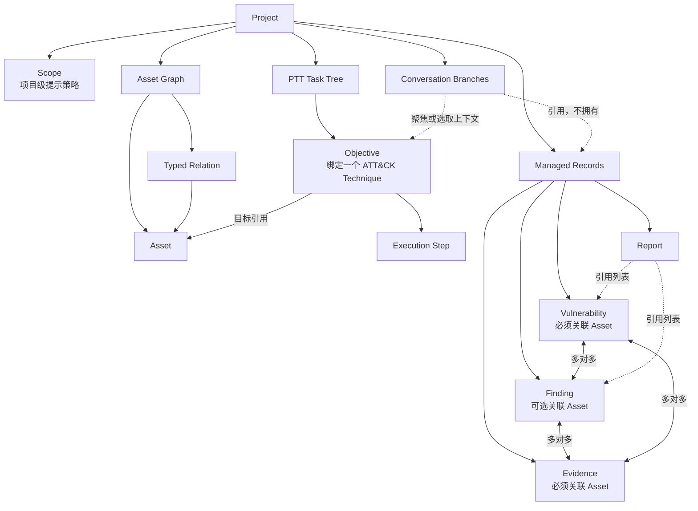

# Hexestra 领域模型

> 维护者参考。普通用户请先阅读[使用指南](user-guide.md)。

Hexestra 把一次渗透测试组织为一个文件夹项目。项目中的 Scope、Asset Graph、任务树和安全记录
构成共享的权威状态；Browser、Terminal、Agent 对话和工作区 tab 围绕这些状态工作，但不各自
维护一份项目事实。

本文使用实现中的英文类型名，以便读者能直接从概念定位到代码。存储与进程边界见
[架构文档](architecture.md)。

## 关系总览



虚线表示“引用或上下文”，不是所有权。切换或分叉 Conversation 不会恢复旧版本的 Asset、Task、
Evidence、Finding、Vulnerability、Report 或项目文件。

## 项目（Project）

项目对应用户选择的文件夹，稳定 ID 位于 `.hexestra/project.json`。这个 ID 在内部 IPC 中
通常以 `sessionId` 或 `projectId` 传递；它们表示同一个文件夹项目身份，不是一次临时 UI 会话。

项目拥有：

- 名称、状态、OPSEC/自主性偏好与 Scope；
- Asset Graph、NetMap 布局和结构化安全记录；
- `ptt.md` 任务树；
- Conversation 与 Agent History；
- 工作区恢复状态和项目级 Traffic、Proxy、Shell 配置；
- 项目内可读文件及 Evidence。

Recent Projects 只是路径引用。将项目从 Recent 中移除不会删除、移动或重写文件夹。

## 范围（Scope）

范围由两种模式和两组独立规则组成：

- `whitelist`：匹配 `allowRules` 的对象标记为 `authorized` / `included`，其余为 `unlisted`。
- `blacklist`：匹配 `excludeRules` 的对象标记为 `excluded`，其余为 `neutral`。

规则可以匹配域名、URL host、IPv4/IPv6 地址和 CIDR。`belongs_to` 结构关系可以把父级标注
传递给子级；其他关系不会自动传播 Scope。

Scope annotation 是读取时计算的投影，不写入 Asset 的 operational status。改变 Scope 不会把
`scanned` 改成 `excluded`，也不会删除 Asset。Browser、Traffic、Terminal 和普通 Agent 行为通常
仍可处理标记为 OUT 的对象。

> Scope 用于语义上下文和优先级提示。真实阻断由 permission mode、Restriction、Rules of
> Engagement、工具处理器校验、Shell 目标校验或 fail-closed 路由等独立机制完成。

## 资产图

### 资产

资产是具有稳定身份的对象。当前图模型包含：

| 类别 | 用途与身份示例 |
| --- | --- |
| `local` | 本机操作员的上下文/路径锚点，例如 `local-operator` |
| `host` | 规范化 IPv4/IPv6 Host |
| `domain`、`subnet` | DNS 名称与网络范围 |
| `port`、`service` | Host 下的网络端口与服务；Port 身份包含 Host、协议与端口号 |
| `webapp`、`api` | Web Application 与 API 根 |
| `endpoint`、`parameter` | API method/path template 与输入位置/名称 |
| `certificate`、`identity` | 证书指纹和身份主体 |

除 Host 外，多数类型通过确定性的 semantic key 合并重复发现。重复注册更新同一身份的属性，
不会因为来自另一次扫描就创建第二个节点。

每个资产还有独立的 operational status：`untested`、`in_progress`、`scanned`、
`vulnerable` 或 `compromised`。它与 Scope annotation 表达不同维度。

### 关系

资产之间只持久化有限的基础关系：

- `belongs_to`（属于）
- `resolves_to`（解析到）
- `connected_to`（连接到）
- `attack_path`（攻击链）

`semantic` 进一步给出严格子类型，例如 `subdomain_of`、`port_of`、`service_of`、
`endpoint_of`、`dns_resolves`、`served_by` 或 `attack_step`。来源工具、命令文本和发现过程不应
被伪装成拓扑关系；它们属于 Evidence 或扫描历史。

### 目标（Target） 与 Netmap

`Target` 不是与 Asset Graph 并列的第二个数据库。`targets:list` 从规范化 Host 与端口/服务记录
重建兼容的详细 Target 投影；NetMap 则从同一批规范记录构造不同视角。

NetMap 有三个 projection：

- `network`：Subnet → Host → Port → Service；
- `domain`：Domain → WebApp/API → 共享 Host；
- `application`：WebApp/API → Endpoint → Parameter。

每个视角有独立的 pan、zoom 和手动位置。Renderer 中的虚拟聚合节点只为可视化服务，不能作为
数据库 Asset 或位置键持久化。选择节点也只是导航与 Agent 当前目标上下文，不会自行修改记录或
启动扫描。

### 发现如何进入图

Terminal、Browser、Traffic、外部工具和 Agent 输出都是非可信输入。Hexestra 不从一段 raw
output 中静默猜测 Asset。标准流程是：

1. 执行发现动作；
2. 将需要保留的原始结果显式保存为 Evidence；
3. 人或 Agent 解释结果；
4. 通过结构化 `asset_register` 写入一个确认的 Asset；
5. 通过 `asset_get` 读回并确认身份与关系；
6. 再继续下一个发现或注册。

Asset registration 可以写 Asset、Endpoint、Relation、Scan Run 和 material change，但不会自动
制造 Evidence。

## 渗透测试任务树（PTT）

`ptt.md` 是任务树的源文件。运行时使用内置的 MITRE ATT&CK Enterprise Catalog 对输入进行校验，
不会从网络动态同步目录。

层级为：

```text
ATT&CK Tactic
└── ATT&CK Technique
    └── Objective（Agent Task）
        └── Execution Step
```

### Objective

Objective 表示一个可验证的测试目标：

- 绑定恰好一个有效 Technique，并选择其 `primaryTacticId`；
- 可引用目标 Asset、所需 capability、首选 tool/Skill 和依赖 Task；
- 拥有 success criteria；
- 是 Scope、ATT&CK 和执行上下文的所有者。

跨 Technique 的工作应拆成多个 Objective，再显式声明依赖，而不是把一个 Task 同时挂在多个
Technique 下。

### Execution Step

Step 是 Objective 下的实际执行计划。它保存顺序、状态、结果摘要、阻塞原因和自己的验收项，
但 ATT&CK、目标、Restriction、Skill 与 Tool 由父 Objective 解析投影而来，不在每个 Step
中复制一份。

一个 Conversation Branch 可以持久化自己的 `focusedTaskId`。Focus 影响该分支下一次 Agent
turn 的动态上下文和活动归属，不会把 Task 变成对话私有数据。

## 记录

### 证据（Evidence）

Evidence 保存来自命名命令或工具的原始、可追溯内容。它必须关联一个真实 Asset，可以额外记录
`sourceAssetId`，并可与多个 Finding 或 Vulnerability 关联。

Evidence 的职责是保存观察到的材料，不负责判断材料意味着什么。摘要、推断、线索和结论应进入
Finding。

### 发现（Finding）

Finding 是可复用的项目知识，类型包括 `observation`、`lead`、`hypothesis`、`behavior`、
`access` 和 `note`。它有 confidence 与 `active` / `used` / `archived` 生命周期，但没有 severity。

Finding 可以关联一个 Asset，也可以是跨 Asset 的项目级知识。它可以引用多条 Evidence；尚未复现
或等价验证的弱点应停留在 Finding，而不是提前创建 Vulnerability。

### 漏洞（Vulnerability）

Vulnerability 表示已复现或等价验证的弱点，因此必须关联真实 Asset。它拥有 severity、
`confirmed` / `remediation` / `resolved` / `accepted` 生命周期，以及 description、impact、
remediation 和可选 CVE/CWE/CVSS。

Vulnerability 可以链接多个 Finding 与 Evidence。未处于 `resolved` 的 Vulnerability 会投影到
Asset 的 `vulnCount`；Finding 本身不会增加风险计数。

### Report （报告）

Report 聚合项目结论，状态为 `draft` 或 `final`，并通过 ID 列表引用 Finding 与 Vulnerability。
删除某条受管记录会清理 Report 中失效的引用，但不会递归删除其他支持材料。

与 Vulnerability 关联的 final Report 必须为每个弱点包含可执行的编号复现步骤和可观察结果。
Renderer 中的 live report preview 不是权威 Report；正式内容需要通过受管写入路径保存，并接受
Main Process 的完整性校验。

## 维护这些概念时

修改领域模型通常会跨越至少三个层面：持久化 schema/repository、Main Process contract/IPC、
Renderer type/store/component。应同时确认：

- 数据只有一个权威写入路径；
- migration 保留稳定 ID 和既有关联；
- `session:data-changed` flags 能让所有受影响投影刷新；
- Agent 工具 schema、handler、read-back 和权限分类保持一致；
- Scope annotation 与 operational status 没有重新耦合；
- Conversation 分支没有被误写成项目记录的所有者。

实现入口包括 [`asset-graph.repository.ts`](../electron/services/asset-graph.repository.ts)、
[`tasks.ts`](../electron/contracts/tasks.ts)、[`asset.ts`](../src/types/asset.ts)、
[`asm.ts`](../src/types/asm.ts) 和 [`netmap.ts`](../src/types/netmap.ts)。
