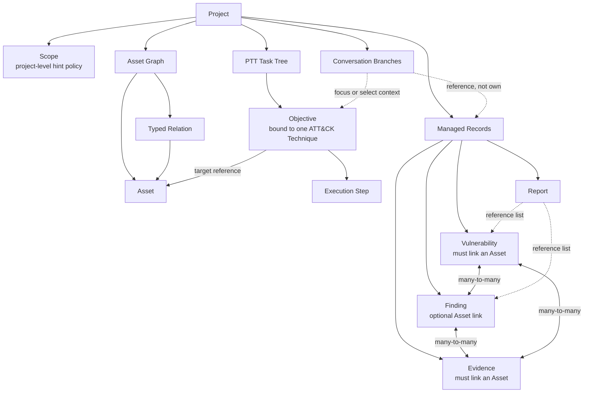

# Hexestra Domain Model

*[English](domain-model.md) · [简体中文](domain-model.zh-CN.md)*

> Maintainer reference. Regular users should start with the [user guide](user-guide.md).

Hexestra organizes a penetration test as a folder project. The project's Scope, Asset Graph, task tree, and security records form the shared authoritative state; Browser, Terminal, Agent conversations, and workspace tabs work around that state without each keeping their own copy of project truth.

This document uses the English type names from the implementation so you can go straight from a concept to the code. For storage and process boundaries, see the [architecture doc](architecture.md).

## Relationship overview



Dashed lines mean "reference or context," not ownership. Switching or forking a Conversation does not restore an old version of an Asset, Task, Evidence, Finding, Vulnerability, Report, or project file.

## Project

A project corresponds to the folder the user selected, with a stable ID in `.hexestra/project.json`. In internal IPC this ID is usually passed as `sessionId` or `projectId`; both denote the same folder-project identity, not a transient UI session.

A project owns:

- name, status, OPSEC/autonomy preferences, and Scope;
- the Asset Graph, NetMap layout, and structured security records;
- the `ptt.md` task tree;
- Conversations and Agent History;
- workspace recovery state and project-level Traffic, Proxy, and Shell config;
- readable files and Evidence in the project.

Recent Projects are just path references. Removing a project from Recent does not delete, move, or rewrite the folder.

## Scope

Scope consists of two modes and two independent rule sets:

- `whitelist`: objects matching `allowRules` are marked `authorized` / `included`, the rest `unlisted`.
- `blacklist`: objects matching `excludeRules` are marked `excluded`, the rest `neutral`.

Rules can match domain names, URL hosts, IPv4/IPv6 addresses, and CIDRs. The `belongs_to` structural relation can propagate a parent's annotation to children; other relations do not propagate Scope automatically.

A Scope annotation is a projection computed at read time and is not written into an Asset's operational status. Changing Scope does not turn `scanned` into `excluded`, nor does it delete an Asset. Browser, Traffic, Terminal, and normal Agent behavior can usually still act on objects marked OUT.

> Scope is for semantic context and priority hints. Real blocking is done by independent mechanisms — permission mode, Restriction, Rules of Engagement, tool-handler validation, Shell target validation, or fail-closed routing.

## Asset graph

### Assets

An Asset is an object with a stable identity. The current graph model includes:

| Kind | Purpose and identity example |
| --- | --- |
| `local` | The local operator's context/path anchor, e.g. `local-operator` |
| `host` | A normalized IPv4/IPv6 Host |
| `domain`, `subnet` | DNS names and network ranges |
| `port`, `service` | Network ports and services under a Host; a Port identity includes Host, protocol, and port number |
| `webapp`, `api` | Web Application and API root |
| `endpoint`, `parameter` | API method/path template and input location/name |
| `certificate`, `identity` | Certificate fingerprint and identity principal |

Except for Host, most kinds merge duplicate discoveries through a deterministic semantic key. Re-registering updates the attributes of the same identity; it does not create a second node just because it came from another scan.

Each Asset also has an independent operational status: `untested`, `in_progress`, `scanned`, `vulnerable`, or `compromised`. It expresses a different dimension than the Scope annotation.

### Relations

Only a limited set of base relations are persisted between assets:

- `belongs_to`
- `resolves_to`
- `connected_to`
- `attack_path`

A `semantic` field further gives a strict subtype, e.g. `subdomain_of`, `port_of`, `service_of`, `endpoint_of`, `dns_resolves`, `served_by`, or `attack_step`. The source tool, command text, and discovery process must not be disguised as topology relations; they belong in Evidence or scan history.

### Target and NetMap

`Target` is not a second database parallel to the Asset Graph. `targets:list` rebuilds a compatible detailed Target projection from normalized Host and port/service records; the NetMap constructs different perspectives from the same normalized records.

The NetMap has three projections:

- `network`: Subnet → Host → Port → Service;
- `domain`: Domain → WebApp/API → shared Host;
- `application`: WebApp/API → Endpoint → Parameter.

Each perspective has its own pan, zoom, and manual positions. Virtual aggregate nodes in the renderer serve visualization only and must not be persisted as database Assets or position keys. Selecting a node is also just navigation and the Agent's current-target context; it does not modify records or launch scans on its own.

### How discoveries enter the graph

Terminal, Browser, Traffic, external tools, and Agent output are all untrusted input. Hexestra does not silently guess an Asset from a chunk of raw output. The standard flow is:

1. run a discovery action;
2. explicitly save the raw results worth keeping as Evidence;
3. a human or the Agent interprets the results;
4. write a confirmed Asset through the structured `asset_register`;
5. read it back with `asset_get` and confirm identity and relationships;
6. then continue with the next discovery or registration.

Asset registration can write Assets, Endpoints, Relations, Scan Runs, and material changes, but does not automatically produce Evidence.

## Penetration test task tree (PTT)

`ptt.md` is the source file for the task tree. The runtime validates input against a built-in MITRE ATT&CK Enterprise catalog and does not sync the catalog from the network dynamically.

The hierarchy is:

```text
ATT&CK Tactic
└── ATT&CK Technique
    └── Objective (Agent Task)
        └── Execution Step
```

### Objective

An Objective represents a verifiable test goal:

- bound to exactly one valid Technique, with a chosen `primaryTacticId`;
- may reference target Assets, required capabilities, preferred tools/Skills, and dependency Tasks;
- owns success criteria;
- is the owner of Scope, ATT&CK, and execution context.

Work that spans Techniques should be split into multiple Objectives with explicit dependencies, rather than hanging one Task under several Techniques at once.

### Execution Step

A Step is the actual execution plan under an Objective. It stores order, status, result summary, blocked reason, and its own acceptance items, but ATT&CK, targets, Restrictions, Skills, and Tools are projected from the parent Objective's resolution and are not copied into each Step.

A Conversation Branch can persist its own `focusedTaskId`. Focus affects that branch's next Agent turn's dynamic context and activity attribution; it does not make a Task conversation-private data.

## Records

### Evidence

Evidence stores raw, traceable content from a named command or tool. It must link a real Asset, may additionally record a `sourceAssetId`, and may link to multiple Findings or Vulnerabilities.

Evidence's job is to preserve observed material, not to judge what the material means. Summaries, inferences, leads, and conclusions belong in a Finding.

### Finding

A Finding is reusable project knowledge, of kind `observation`, `lead`, `hypothesis`, `behavior`, `access`, or `note`. It has a confidence and an `active` / `used` / `archived` lifecycle, but no severity.

A Finding can link one Asset or be cross-asset project knowledge. It can reference multiple Evidence; a weakness not yet reproduced or equivalently verified should stay a Finding rather than becoming a premature Vulnerability.

### Vulnerability

A Vulnerability represents a reproduced or equivalently verified weakness, so it must link a real Asset. It owns a severity, a `confirmed` / `remediation` / `resolved` / `accepted` lifecycle, and description, impact, remediation, and optional CVE/CWE/CVSS.

A Vulnerability can link multiple Findings and Evidence. A Vulnerability not in `resolved` projects into the Asset's `vulnCount`; a Finding alone does not raise the risk count.

### Report

A Report aggregates project conclusions, has a `draft` or `final` status, and references Findings and Vulnerabilities by ID list. Deleting a managed record cleans up stale references in a Report but does not recursively delete other supporting material.

A final Report linked to Vulnerabilities must include executable numbered reproduction steps and observable results for each weakness. The live report preview in the renderer is not the authoritative Report; the formal content must be saved through the managed write path and pass main-process integrity validation.

## When maintaining these concepts

Changing the domain model usually spans at least three layers: the persistence schema/repository, the main-process contract/IPC, and the renderer type/store/component. Confirm together that:

- data has only one authoritative write path;
- migrations preserve stable IDs and existing links;
- `session:data-changed` flags refresh all affected projections;
- the Agent tool schema, handler, read-back, and permission classification stay consistent;
- Scope annotation and operational status are not re-coupled;
- a Conversation branch is not mistakenly made the owner of project records.

Implementation entry points include [`asset-graph.repository.ts`](../electron/services/asset-graph.repository.ts), [`tasks.ts`](../electron/contracts/tasks.ts), [`asset.ts`](../src/types/asset.ts), [`asm.ts`](../src/types/asm.ts), and [`netmap.ts`](../src/types/netmap.ts).
